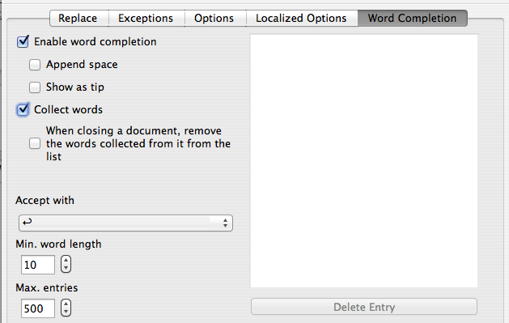
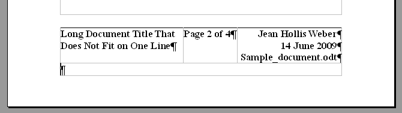
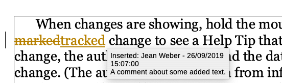
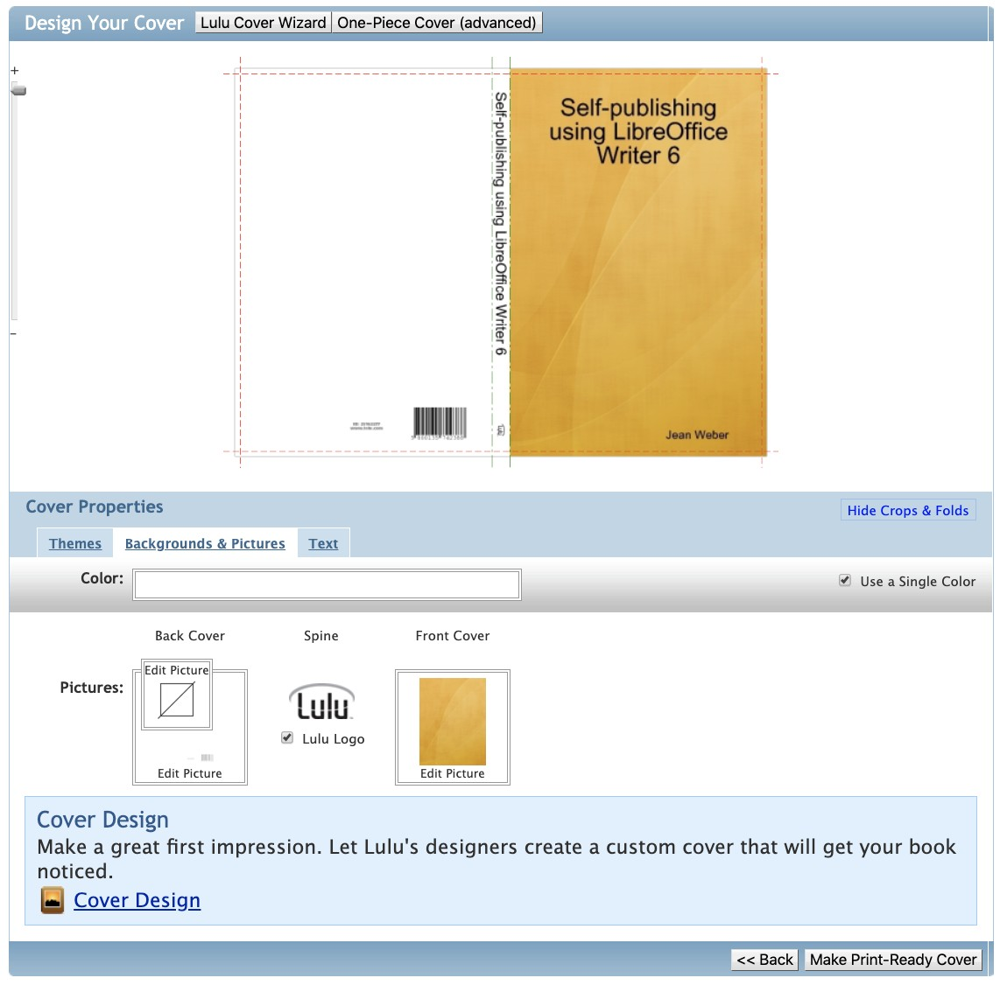

# 利用 LibreOffice Writer 6 进行自出版——如何利用自由软件来编写、设计和创建用于按需印刷书籍的电子书和便携式文档

Jean Hollis Weber 著

著作权所有 (C) 2019 Jean Hollis Weber

此书基于知识共享：署名许可证 v4.0 [CC BY 4.0](https://creativecommons.org/licenses/by/4.0)。此中文版基于知识共享：署名——相同方式共享许可证 v4.0 [CC BY-SA 4.0](https://creativecommons.org/licenses/by-sa/4.0)。

此向导中的所有商标属于它们的合法持有者。

此书利用以下自由软件创建：LibreOffice Writer 6.3（文字处理、页面布局，和便携式文档（PDF）创建）、GIMP 2.10（图像编辑），以及 Calibre 4.00（电子书创建）。这些软件可用于 Windows、GNU/Linux 和 macOS。

封面照片由 Jeans Hollis Weber 贡献：Agile wallaby，澳大利亚

# 前言

此书用于那些想要编写一部诸如小说、诗歌或散文集，或者非小说等书籍篇幅的文档，并且随后利用诸如~~亚马逊 Kindle Direct Publishing~~、Lulu 或者类似的在线服务来出版该书的 LibreOffice Writer 入门到进阶用户。

## 0.1 为何使用 LibreOffice？

人们出于若干原因而使用 LibreOffice：

* 没有授权许可问题。您可以根据个人喜好将此软件安装于任意多台计算机上，以及将其副本赠送给任意多的人们。LibreOffice 不需要激活或者注册，并且它从不会“打电话回家”，除非您告知它如此做——例如检查更新
* 没有强制费用。您从不必须支付任何费用以获取一份副本，如果您是从官方网站下载它
* 多平台支持。它可以运行于微软 Windows、苹果 macOS，以及 GNU/Linux 上
* 文件兼容性。您可以打开并且保存至多种文件格式，除了默认的开放文档（OpenDocument）格式以外，还包括~~微软 Office 格式~~
* 内建的便携式文档（PDF）导出功能。您不需要使用其他软件以创建 PDF，除非您的印刷服务提供商要求您如此做
* 内建的 EPUB，一种流行的电子书格式的导出功能。您可能还需要使用自由并且开放源代码的 Calibre 软件来清理任何格式问题，并且将 EPUB 转换为 ~~MOBI（用于 Kindle）~~及其他格式。

## 0.2 您首先需要做什么？

此书假设您已经在您的计算机上成功安装了 LibreOffice，以及您知道如何创建、编辑和保存文件。尽管此书面向 LibreOffice 6.3 而编写，大部分信息也和其他版本的 LibreOffice 相关。某些细节可能会因版本以及您所使用的操作系统而异。

如果您还没有一份 LibreOffice 副本，或者您想要升级至最新版本，前往 <https://www.libreoffice.org> 以下载一份自由的副本。

您可能还想安装 Calibre，它可以从 <https://calibre-ebook.com> 获得，此外还有 GIMP <https://www.gimp.org>。

## 0.3 在一台 Mac 上使用 LibreOffice

某些按键和菜单项目在 macOS 中同在 Windows 和 GNU/Linux 中所使用的不同，下表给出了关于此书中的指令的某些常用替换。如需获得更为详细的列表，参见应用程序帮助。

|Windows 和 GNU/Linux|macOS 对应项|效果|
|----|----|----|
|通过菜单选择“工具 > 选项”|“LibreOffice > 偏好”|访问设置选项|
|右键点击|“Control+点击”和/或“右键点击”，取决于计算机设置|打开上下文菜单|
|Ctrl（Control）|⌘（Command）|配合其他键使用|
|F5|Shift+⌘+F5|打开“导航”|
|F11|⌘+T|在侧边栏中打开“样式”|

提示：如果您是一位 Mac 用户，并且您的主要目的是出版，您可能更倾向于使用苹果的免费（但是不开放源代码的）出版软件，~~Pages 和 iBook Author~~ 之一。但是如果您将 LibreOffice 用于其他日常工作，您可能更倾向于探索它的出版能力。

## 0.4 您所看到的哪些东西可能不同

此书中的插图主要截取自一台运行 macOS Mojave 的 MacBook。因此，某些插图可能与您从您的计算机显示器上看到的略有不同。

## 0.5 术语

LibreOffice 中所使用的，用于大部分用户界面（您所看到并且使用的程序部分，相对于使其运作的代码而言）的术语同用于大部分其他软件的术语相同。

对话框是一种特殊类型的窗口，它的目的是告知您某些事情，或者请求来自您的输入，或者二者兼有。它为您提供了控件，用于指定如何执行某个动作。

在大多数情况下，您只能同该对话框——而非文档本身——进行交互，只要该对话框持续打开。如果您在使用对话框之后关闭它（通常，点击“确定”（OK）或者另一个按钮将会保存您的更改并且关闭对话框），那么您将能够再次回到文档进行工作。

有些对话框可以在您工作时保持打开，于是您可以在该对话框和您的文档之间来回切换。关于此类对话框的一个范例是“查找和替换”（Find &amp; Replace）对话框。

## 0.6 如何获得关于自出版的更多信息

此书介绍了 Writer 作为用于准备用于自出版的书籍的 PDF 的工具，但是它并未涵盖印刷和出版过程中的其他方面，或者不同的按需印刷服务的具体细节。此书也并未讨论您需要作出的关于您的书籍的设计的某些重要决策。

您可以找到大量关于这些话题的书籍。Bruce Byfield 所著的 _Designing with LibreOffice_ 一书是一部关于设计的优秀资源，并且讨论了样式和模板的使用，相对于此书而言详细得多。该书可以从 <https://designingwithlibreoffice.com> 获得。

此书还涵盖了从 Writer 文件制作一部电子书（EPUB）的方法，利用 Writer 本身或者同开放源代码的软件 Calibre 相结合，它可以从 <https://calibre-ebook.com> 获得。电子书的设计同样会在 Bruce Byfield 即将出版的新书 _Designing Ebooks_ 中加以讨论。

## 0.7 致谢

此书中的相当多的素材基于 _Getting Started with LibreOffice_ 和 _LibreOffice Writer Guide_。这些书籍由志愿者团队制作，其副本可以作为自由的 PDF 从 LibreOffice 网站获得，以及通过由“开放文档之友”（Friends of OpenDocument, Inc.）在 Lulu 上出版的廉价印刷版本而获得。相关网址如下：

* <https://documentation.libreoffice.org/en>
* <https://www.lulu.com/spotlight/opendocument>

# 第一部分：基本内容

此书的前八章涵盖了每一位自出版者关于使用 LibreOffice Writer 进行书籍的创作和出版所需要知道的内容。

1. Writer 简介
2. 设置 Writer
3. 写作和编辑
4. 利用 Writer 的样式设计您的书籍
5. 格式化页面
6. 格式化文本
7. 创建 PDF 和封面
8. 创建电子书

第二部分（始于原书第 113 页）的八章涵盖了可能与您的书籍、您对于 LibreOffice Writer 的使用，或者您对于出版服务的选择相关的话题，但是并非每一位读者所必需。

# 第一章 Writer 简介

Writer 是 LibreOffice 的文字处理组件，它提供了文字处理器的通常功能，包括拼写检查、同义词表、断词、自动更正，以及查找与替换等。它还拥有自出版者所感兴趣的众多重要特性：

* 强大的页面布局
* 简单易用的模板和样式
* 导出为 PDF 或 EPUB
* 放置图片和图形
* 自动创建内容目录和索引
* 在编辑过程中跟踪更改

学习如何利用 Writer 来创建、编辑和管理文档是重要的第一步。本章将会介绍这些基本知识。

Writer 类似于微软 Word，但同时又有所不同。如果您熟悉 Word，您可能需要在您使用 Writer 进行工作时学习某些新的方式。如果您未能在 Writer 中找到某种特定功能，不要假设该特性不存在。Writer 可能会以不同的方式来处理它。

## 1.1 Writer 工作空间

最常用的 Writer 主要工作空间视图（称为“普通”（Normal））如下页所示。

### 1.1.1 标题栏和菜单栏

标题栏显示了当前文档的文件名，如果该文档还未被命名，该文档的名称将会被显示为“未命名 X”（Untitled X），在此 X 为一个数字。未命名的文档按照其被创建的顺序来编号。

菜单栏在 Windows 和 GNU/Linux 中位于标题栏的下方，而在 macOS 中位于屏幕顶端。如果您选择菜单之一，一个子菜单将会出现在下方以显示更多选项。

### 1.1.2 侧边栏

Writer 中的侧边栏默认包含五个面板：“属性”、“页面”、“样式”（在某些副本中显示为“样式和格式”）、“图片库”和“导航”。每个面板可以通过点击其在侧边栏右侧的选项卡栏中的对应图标来打开。

另有两个额外的面板可用：“管理更改”和“设计”。您可以通过在“工具 > 选项 > LibreOffice > 高级”中的“启用实验性功能”页面中选中这些面板来启用它们。

侧边栏面板像是工具栏和对话框的组合，例如，您可以自由地将在主要编辑窗口中输入文字和利用侧边栏中的“属性”面板更改文字属性相结合。某些面板带有一个“更多选项”按钮，这将会打开一个具有更多编辑控件的对话框。

工具栏和侧边栏面板共享了很多功能。例如，用于将文本设置为粗体或者斜体的按钮存在于“格式”工具栏和“属性”面板中。

### 1.1.3 工具栏

Writer 的大部分工具栏可以固定或者悬浮。它们可以被移动到 Writer 工作空间的不同位置（顶部、侧面、底部），它们甚至还可以悬浮于 Writer 窗口之外。

顶部的工具栏称为“标准”工具栏。所有 LibreOffice 组件（Writer、Calc、Draw、Impress、Base）都拥有此工具栏。

顶部的第二个工具栏称为“格式”工具栏。它显示了与当前选定的内容或者光标所处位置相关的工具。例如，如果光标位于文本之中，它所显示的工具为 Writer 的文本格式化工具。如果选中了一幅图形，“格式”工具栏则会显示用于格式化图形的工具。

如需为文档留出更多空间，您可以选择一种包含了最常用命令的“单一工具栏”作为替代。如需激活此功能，启用“视图 > 用户界面 > 单一工具栏”。

Writer 还提供了若干种替代的工具栏编排方式，您可以在“视图 > 用户界面”菜单中找到。

某些其他工具栏通常只会在上下文环境要求它们的时候出现。例如，如果光标位于某个表格中，则“表格”工具栏将会出现。如果光标位于某个列表之中，则“项目符号和编号”工具栏将会出现。

如需显示或者隐藏工具栏，选择“视图 > 工具栏”，然后在列表中点击某个工具栏的名称。活动的工具栏的名称旁边会出现复选标记。

如需移动一个固定的工具栏，点击它的控点并且将其拖曳到新的位置。如需移动一个悬浮的工具栏，点击它的标题栏并且将其拖曳到新的位置。将悬浮的工具栏拖曳到某个固定位置将会使其变为固定的工具栏。

### 1.1.4 自定义工具栏

您可以选择某个工具栏上都有哪些图标可见，您还可以添加图标并且创建新的工具栏，如第 15 章所述。

如需自定义某个工具栏，右键点击工具栏上的图标之间的位置，将会弹出下拉菜单。

从该菜单中选择“可见的按钮”以打开子菜单。可见的按钮通过图标周围的边框或者图标旁边的复选标记而标识出来（取决于您的操作系统）。点击某个图标以选中或者取消选中它。

### 1.1.5 右键（上下文）菜单

您可以通过右键点击某个段落、图形，或者其他对象来快速访问众多菜单功能，这将会弹出一个上下文菜单。此上下文菜单通常是访问某种功能的最为快捷的方式。如果您不清楚如何从菜单或者工具栏中找到某个功能，您通常能够通过右键点击来找到它。

### 1.1.6 状态栏

Writer 状态栏既提供了关于文档的信息，又提供了便捷的方式以快速更改某些文档特性。从左至右出现的字段如下所述。

#### 1.1.6.1 页码

显示当前的页码、当前页面的顺序数（如果不同），以及文档中的总页数。如果您在第三页将页码重新编排为 1，则它的页码是 1，而该页面的顺序数为 3。

如果在该文档中定义了任何书签，则右键点击此字段将会弹出一个列表。点击所需的书签以跳转到文档中的该位置。

如需跳转到文档中的某个特定页面，点击此字段，将会打开一个小对话框。输入所需页面的顺序数，则显示将会跳转到该页面。

#### 1.1.6.2 单词和字符数统计

显示文档中的单词和字符数量，并且随着您的编辑而更新。如果您选定了某些文本，该选定区域的计数将会暂时取代文档的整体计数。

字符计数默认包括空格，如需显示排除空格的字符计数，双击状态栏中的单词和字符数统计字段，或者选择“工具 > 字数”，一个小对话框将会打开。

#### 1.1.6.3 页面样式

显示选定页面的样式。如需更改页面样式，右键点击此字段；将会打开“页面样式”对话框。

注意：在这里更改页面样式可能会影响后续页面，取决于页面样式如何设置。参见第 4、5 章以获得关于页面样式的更多信息。

#### 1.1.6.4 语言

显示用于拼写检查、断词和同义词典的语言和本地化设置，基于光标所处的位置或者选定的文本。点击它以打开一个菜单，您可以在其中为选定的文本或者光标所在的段落选择另一种语言。您还可以选择“无（不检查拼写）”。选择“更多”以打开“字符”对话框。

#### 1.1.6.5 插入模式

当处于插入模式时，该字段为空白。点击它以切换到改写模式；再次点击以回到插入模式。

#### 1.1.6.6 选择模式

右键点击以选择不同的选择模式。此图标不会发生变化，但是一个工具提示将会指示哪种模式处于活动状态。参见 _Writer Guide_ 以获得关于这些模式的更多信息。通常，您将会使用标准选择模式。

#### 1.1.6.7 文档状态

不同的图标将会出现在此，如果该文档拥有未保存的更改，或者如果所有更改都被保存。一个工具提示也会指示出此状态。

#### 1.1.6.8 数字签名

一个图标将会出现在此，如果该文档已经被数字签名。双击此图标以查看证书。

#### 1.1.6.9 对象信息

如果光标位于某一节、某个标题，或者某个列表项目，或者如果某个对象（诸如图片或者表格）被选中，关于该项目的信息将会出现在此字段中。双击此字段将会打开相应的对话框。

#### 1.1.6.10 视图布局

点击一个图标以便在单页、多页和书本视图之间切换。您可以在任何视图中编辑文档。

缩放设置同选定的视图布局，以及窗口宽度共同作用以决定文档窗口中有多少页面可见。

#### 1.1.6.11 缩放

如需更改视图的放大比例，拖曳缩放滑块或者点击 +、- 符号，或者右键点击百分比字段以弹出一个选择列表。

您也可以双击百分比字段以打开“显示比例和视图布局”对话框。

## 1.2 更改文档视图

Writer 提供了三种方式以查看一篇文档：普通、网页和全屏。如需更改此视图，前往“视图”菜单并且点击所需的视图。（如果处于全屏视图模式，按下 Esc 键以回到普通或者网页视图。）

如果处于普通视图，您可以使用状态栏上的缩放滑块和视图布局图标。在网页视图中，您只能使用缩放滑块。

您也可以从菜单栏选择“视图 > 缩放 > 显示比例”来打开“显示比例和视图布局”对话框，在此，您可以设置同状态栏上相同的选项。在网页布局视图中，大部分选项不可用。

## 1.3 使用导航

除了状态栏上的页码字段（描述于原书第 21 页），Writer 还提供了其他方式以便在一篇文档之中快速移动。导航、“导航”工具栏，以及相关图标所提供的众多功能可以帮助您在一篇文档中找到特定项目。

导航列出了一篇文档中所包含的所有标题、表格、文本框、图形、书签，以及其他对象。如需打开导航，点击它在侧边栏上的图标。

在类别列表中，点击任意列表旁边的 + 符号以显示该列表中的内容。

导航最上方的图标拥有如下所述的效果：

* 导航：打开“导航”工具栏
* 上一页、下一页：跳转到文档中的上一个或者下一个项目。如需选择项目的类别，参见原书第 25 页
* 页码：跳转至文本框中的页码。输入该页码或者利用上下箭头进行选择
* 拖拽模式：选择超链接、链接，或者副本
* “内容导航”视图：在显示所有类别与仅仅显示所选定的类别之间切换
* 设置提醒：插入一条提醒信息（参见原书第 26 页）
* 页眉、页脚：在文本区域与页眉或页脚（如果该页面拥有它们）区域之间切换
* 锚点\<-\>正文：在脚注的锚定点与对应的脚注文本之间切换
* 显示的标题级别：选定需要显示的级别的数量

其他图标对应于此文档并未涵盖的高级特性。

### 1.3.1 在一篇文档中快速移动

导航提供了若干种便捷的方式以便在一篇文档之中移动，并且查找其中的项目：

* 如需跳转至文档中的某个特定页面，在导航顶端的文本框中输入该页面的顺序数
* 如果某个类别正在显示其中的对象列表，双击某个对象以直接跳转至该对象在文档中的位置
* 如果只需查看某一个类别中的内容，高亮选中该类别，并且点击“内容导航”视图。再次点击该图标以显示所有类别。您还可以更改所显示的标题层级的数量
* 利用“上一页”和“下一页”图标来跳转至“导航”工具栏中的选定类型的其他对象（见下文）

提示：如果您在创建对象时给它们起了名字，而非保持 Writer 默认的诸如“图形 1”、“图形 2”、“表格 1”、“表格 2”等名字，对象将会更加容易查找。这些默认的名字可能并不对应于这些对象在最终文档中的位置。

### 1.3.2 使用“导航”工具栏

如需显示“导航”工具栏，点击导航中的导航图标（参见原书第 24 页）。

“导航”工具栏显示了导航中所显示的所有对象类别的图标，加上某些额外的图标（例如，来自“查找”命令的结果）。

点击某个图标以显示该对象类别。现在，所有的“上一页”和“下一页”图标（不论位于导航本身，“导航”工具栏，还是“查找”工具栏）都会跳转至该选定类别的上一个或者下一个对象。这尤其有助于查找诸如书签和索引项等项目。它们可能难于在正文中找到。图标的名称（显示于工具提示中）将会发生改变，以便同选定的类别相匹配；例如，“下一个图形”或者“下一个书签”等。

### 1.3.3 设置提醒

Writer 的一项较少为人所知，但却非常有用的功能是提醒信息。提醒信息允许您在您的文档中的不同位置做标记，而您将会在随后回到这些位置，以添加或者改正信息，进行其他更改，或者只是简单地标记出您的编辑已经完成到了哪里。提醒信息的可能的用途只会受到您的想象力的限制。

如需在光标的位置设置一条提醒信息，点击导航中的“设置提醒”图标。您可以在一篇文档中设置最多五条提醒信息（设置第六条会导致第一条被删除）。

提醒信息并不会在文档中以任何方式高亮显示出来，因此您不能看到它们在何处，除非您从其中一个跳转至下一个——此时光标的位置显示出了提醒信息所在的位置。

如需在提醒信息之间跳转，首先在“导航”工具栏或者“查找”工具栏中选择“提醒”图标，然后点击“上一页”或者“下一页”图标。

## 1.4 创建一篇新文档

如需在 Writer 中创建一篇新的空白文档：

* 如果 LibreOffice 已经打开，但是并没有任何文档被打开，点击开始中心中的“文本文档”图标，或者点击“模板”图标以便利用某个模板来开始创建一篇新的文档
* 如果已经有一篇文档在 Writer 中被打开：
    * 按下 Control+N 键，或者
    * 使用“文件 > 新建 > 文本文档”，或者
    * 点击主要工具栏中的“新建”图标

新建文档将会在新的 Writer 窗口中打开。

### 1.4.1 从模板创建文档

模板被用作一个文档集合的基础，以保证该集合中的所有文档拥有某种相似的布局：相同的页面大小、相同和页眉和页脚、相同的字体等等。

如果您计划将您的书籍的章节保存为独立的文件，并且在最后将其合并到一个文件中来，如原书第 28 页所示，那么，您应该使得各个章节基于同一个模板。

如需基于模板创建新的文档，选择“文件 > 新建 > 模板”或者点击开始中心中的“模板”图标。在“模板”对话框中，选择所需的模板，并且点击“打开”。如需获得关于模板的更多信息，参见第 14 章。

## 1.5 保存一篇文档

Writer 以一种称为 OpenDocument 文本（ODT）的文件格式保存文件。

如需保存一篇文档：

* 按下 Control+S，或者
* 使用“文件 > 保存”，或者
* 点击主要工具栏中的“保存”图标

如需以不同的名称保存一篇文档，选择“文件 > 另存为”。

### 1.5.1 保存为~~微软 Word 文档~~

如果您需要同微软 Word 用户交换文件，您可以将文档保存为~~微软 Word 文件~~。

1. 点击“文件 > 保存副本”
2. 在“保存副本”对话框中，在“文件类型”下拉列表中，选择您所需要的 ~~Word 文档~~类型。点击“保存”

此过程会导致这样一种不理想的情况，在您的计算机上保留该文档的两个版本：ODT 和 ~~DOCX~~。

您将要继续使用 LibreOffice（ODT）版本进行工作。

## 1.6 将若干个文档合并至一部书籍之中

构建您的书籍的一种方式是将各个章节保存在独立的文档之中。审稿人或者编辑可以随后处理各个章节，而同时您可以处理其他章节。

当该书完成时，您需要将所有章节以及其他素材（标题页、著作权信息页等）合并到一个文件之中，然后再进行最后的格式化、创建内容目录，以及生成用于印刷的 PDF 等等。

如需合并文件：

1. 打开第一个文件，确保段尾标记可见
2. 前往文档的最后一页。如果末尾没有空白段落，在最后一段的末尾按下 Enter 键以创建一个空白段落
3. 当光标位于空白段落中时，从菜单栏选择“插入 > 文本取自文件”，这将会打开文件浏览器
4. 选择第二个文档并且点击“打开”
5. 等候几秒钟以供文件打开和编页，随后对于第三篇以及后续的文档重复步骤 2-4，直到所有文档都被包括进来。以另一个文件名保存该书
6. 继续进行最终的格式化（参见第 5 章）

关于母版文档的注释：LibreOffice 拥有一种母版文档特性，以用于将一系列文件合并到一个文件中来。尽管母版文档确实能够工作，它们拥有某些异常行为，使得它们对于主要是文本的书籍而言与其说是价值不如说是麻烦。母版文档最好被留给更加复杂的文档。基于此原因，它们并未被此书涵盖。

# 第二章 设置 Writer

本章描述了如何设置 Writer 的一些特性。您可能想要直接投入到您的书籍的写作或者设计中来，但是花上几分钟来阅读本章可能能够在将来免除您的麻烦。

本章并不会涵盖所有选项。参见帮助文件或者 _Writer Guide_ 一书以获取更多信息。

提示：众多选项的本意是用于高级用户和程序员。如果您不清楚某个选项将会做些什么，通常最好的方式是使其保留原状，除非此书中的指导意见建议您更改此设置。

## 2.1 选择适用于 LibreOffice 全部组件的选项

在菜单栏中点击“工具 > 选项”。如果您没有看到“选项”对话框中的次级菜单，点击 LibreOffice 左侧的扩展图标（+ 符号或者三角形）。

### 2.1.1 用户数据

由于 LibreOffice 会将存储于“用户数据”中的名字或者缩写用于若干件不同的事情，诸如文档属性（创建者和最终编辑者的信息）以及批注和更改的作者，您可能想要确保此页面的字段显示的是正确的信息。

### 2.1.2 视图选项

视图选项控制着文档窗口的外观和行为方式。某些选项如下所述：

#### 2.1.2.1 用户界面——图标大小和样式

更改用于工具栏、侧边栏和其他图标的大小和样式。

#### 2.1.2.2 菜单——菜单中的图标

使得菜单中的图标出现于单词旁边。

#### 2.1.2.3 字体列表——显示字体的预览

在显示字体名称的同时显示字体的范例。

### 2.1.3 打印选项

设置用于默认打印机和最常用的打印方法的打印选项。您可以于任何时机更改这些设置，通过利用此页面或者在打印过程中点击“打印”对话框中的“选项”按钮。

在靠近底部的“打印机的警告”部分，您可以选择当发生文档中的纸张大小或者方向同打印机中的纸张大小或者方向不匹配等情况时收到警告信息。

提示：如果您的印刷品的页面排布错误，或者在页面顶端、底部或者两侧被剪裁，或者打印机拒绝打印，很可能是由于页面大小的不兼容性。同时参见原书第 38 页“Writer 打印选项”。

### 2.1.4 字体选项

如果您收到了一份包含了您的系统上所没有的字体的文档，LibreOffice 将会为它所未能找到的字体使用替换字体。在“LibreOffice——字体”页面上，您可以指定一种不同于该程序所选择的字体。

### 2.1.5 安全选项

利用“LibreOffice——安全”页面以选择用于保存文档和打开包含宏的文档的安全选项。如需获得关于这些选项的更多信息，参见帮助或者 _Writer Guide_ 一书。

### 2.1.6 应用程序颜色选项

如果您能够看到页边（文字边界）、表格和节的边界、网格线以及其他特性，写作、编辑，以及（尤其是）页面布局将会变得容易。此外，您可能更加偏好不同于 LibreOffice 的默认值的颜色以用于诸如注释指示和字段阴影等项目。

* 如需显示或者隐藏诸如正文边界等元素，选择或者取消选择它们
* 如需改变这些项目的颜色，点击“颜色设置”一栏的向下箭头并且从下拉列表中选择一种颜色
* 如需将您的颜色更改保存为一种颜色方案，在“方案”框中输入一个名字并且点击“保存”

注释：如需更改“跟踪更改”模式中所使用的颜色设定，前往“工具 > 选项 > LibreOffice Writer > 更改”（参见原书第 40 页）

## 2.2 选择保存选项

在“选项”对话框内点击“载入/保存”左侧的展开符号（+ 符号或者三角形）并且选择“一般”。某些项目描述如下。

### 2.2.1 保存前编辑文档属性

如果此选项被选中，当您首次保存新建文档（或者每当您使用“另存为”功能）时，“文档属性”对话框将会弹出以提示您输入相关信息。

### 2.2.2 始终创建备份副本

推荐选中。

### 2.2.3 保存自动恢复信息的时间间隔

选择是否启用自动恢复以及多么频繁地保存用于自动恢复过程的信息。

### 2.2.4 默认文件格式和 ODF 设置

文档类型：如果您程式化地同微软 Word 用户分享文档，您可能想要将用于文本文档的“始终保存为”属性更改为 ~~Word 格式~~之一。参见原书第 25 页“保存为~~微软 Word 文档~~”以获得更多信息。

## 2.3 选择用于 Writer 的选项

在“选项”对话框中的“LibreOffice Writer”页面部分所选择的设定将会决定您的 Writer 文档在您处理它们时的外观和行为。

点击“选项”对话框的左侧部分中的“LibreOffice Writer”旁边的展开符号（+ 符号或者三角形），将会打开一个页面的列表。

### 2.3.1 Writer 通用选项

此页面上的设置控制着链接和字段的更新，用于标尺和其他度量的单位，制表符间隔，以及字数统计行为等。

#### 2.3.1.1 度量单位

文档设计者推荐使用“磅”（point）作为默认度量，由于您可以很容易地将诸如字体大小同诸如缩进和制表符间隔等关联起来。

提示：如需修改标尺本身的度量单位，右键点击标尺，然后从弹出的列表中选择所需单位。这一更改并不会改变通过“工具 > 选项”而选择的度量单位。

#### 2.3.1.2 制表位

默认的制表位设置控制着两件事：段落内部的制表符间隔以及使用“格式”工具栏中的“增大缩进”按钮时整个段落的缩进。

注释：不建议使用默认的制表位来分隔页面上的素材，这可能会导致重大格式问题。与之相反，在段落样式或者个别段落中定义您自己的制表符间隔，如原书第 92 页“定义您自己的制表符间隔与缩进”所述。

#### 2.3.1.3 字词统计——其他分隔符

对于字数统计，指定那些被认为是用于分隔单词的字符，除了空格、制表符、换行符以及分段符以外。

#### 2.3.1.4 字词统计——每标准页面的字符数

编辑和出版商通常会将“标准”页面定义为包含一定数量的字符或者单词；此数字允许对这种页面的数量进行快速计算。

### 2.3.2 查看选项

设置“查看”和“格式化辅助”这两个页面上的用于查看 Writer 文档的默认值。

“查看”是一个检查您是否不会看到异常图形或者您是否看到字段代码而非文本或者数字的好地方。

### 2.3.3 格式化辅助选项

用于制表符和段尾的符号有助于您写作、编辑以及进行页面布局。您可能想要知道是否存在着任何制表符或者空白段落，或者是否任何表格或者图形延伸到了页边。

注释：“直接光标定位”允许您在页面上的任何空白区域放置文本、图像、表格、框架及其他对象。Writer 通过插入空白段落和制表符来定位这些文本或者对象。**避免使用这项特性**。它与样式的正确使用不兼容，并且会导致奇怪的格式。

### 2.3.4 网格选项

“对齐到网格”自动将某个对象移动到最近的网格线。这可能在您试图对齐诸如图形或者表格等对象时有用。您可以调整网格的尺度，也可以指定网格的其他细节。

### 2.3.5 标准字体（西方文字）

这些选项用于编辑网页时。它们在此并不相关。您需要在段落和字符样式中设置您的字体。

### 2.3.6 Writer 打印选项

选择在默认条件下，哪些项目将会被随着文档打印出来。这些选项是对“LibreOffice——打印”页面（原书第 31 页）中的选项的附加。

一些考虑：

* 如果您正在处理草稿，并且想要节省打印机墨水或者墨粉，您可以取消选择“内容”部分中的某些项目
* 选中“将文本打印为黑色”将会导致彩色文本（而非图形）被打印为纯黑色，不论在彩色还是黑白打印机上。（在大多数黑白打印机上，彩色文本和图形被打印为灰度。）

    将此选项同“LibreOffice——打印”页面（原书第 31 页）的“彩色转换成灰度”相对比，后者导致彩色文本和图形在彩色打印机上被打印为灰度。

* 如果您在不支持自动双面打印的打印机上进行双面打印，仅打印左页或者右页，然后将这一叠纸张翻转过来以打印另一半
* 取决于您的打印机如何输出页面（面朝上还是面朝下），您可能需要逆序打印页面以使得它们在打印时能够以正确的顺序堆叠起来

提示：您可以在打印一篇文档时覆盖这些默认值中的任何一个。点击“文件 > 打印”，然后点击“打印”对话框中的“选项”按钮，将会出现类似于上图的“打印机选项”对话框。

### 2.3.7 表格选项

使用此页面以指定表格的默认行为。

* 如果您的大部分表格需要边框或者表头，选中这些选项，否则在这里取消选择边框和表头，并且按需将其添加到个别表格中
* 如果您的大部分表格包含数字数据，“数字识别”将会非常有用。例如 Writer 将会识别日期或者货币，并且适当地格式化数字。然而如果您希望数字仍然作为普通文本，取消选中此选项

### 2.3.8 更改跟踪选项

如果您计划使用 Writer 的更改跟踪特性（描述于第 13 章），利用“更改”页面以选择插入和删除的素材被如何标记出来，诸如粗体或斜体等属性更改是否以及如何被标记出来，以及更改指示条是否以及如何出现在页边。

## 2.4 选择语言设置

您可能想要对语言设置进行若干操作：

* 更改某些区域的语言设置
* 选择拼写检查选项
* 选择语法检查选项

### 2.4.1 更改某些区域和语言设置

您可以更改 LibreOffice 用于全部文档或者特定文档的区域和语言设置的某些细节。

在“选项”对话框的左侧选择“语言设置 > 语言”，在右侧按需更改用于文档的用户界面、区域设置、默认货币和默认语言。在本例中，英语（英国）被选择用于所有设置。

如果您希望语言（词典）设置仅被应用于当前文档，而非作为所有新建文档的默认值，选中“仅适用于当前的文档”。

在此，您还可以选择对应的选项以启用亚洲语言（中日韩）以及复杂文本排版语言，诸如印地语、泰语、希伯来语和阿拉伯语等的支持。

### 2.4.2 选择拼写检查选项

在“选项”对话框左侧选择“语言设置 > 写作辅助”，在右侧靠近底部的位置选择对您有用的设置。

* 如果您不希望在您打字的时候进行拼写检查，取消选择“键入时检查拼写”
* 如果您使用了一种用到了大写字母单词和带有数字的单词的自定义词典，选择“检查大写字母”和“检查带数字的词”
* “检查特殊区域”用于检查诸如页眉、页脚、框架和表格等处的拼写

在此，您还可以检查哪些用户定义（自定义）的词典处于活动状态。通过“新建”或者“删除”按钮来添加或者移除它们。

### 2.4.3 选择语法检查选项

在“语言设置——英语句子检查”（Language Settings - English Sentence Checking）页面，您可以选择哪些项目被检查、报告或者自动转换。在选择额外的语法检查之后，您必须重新启动 LibreOffice 或者重新加载该文档以使其生效。

# 第三章 写作和编辑

本章涵盖了利用 Writer 进行写作和编辑的基础。格式化、字体、符号和列表涵盖于第 6 章。

* 选择、复制、粘贴和移动文本
* 查找和替换文本
* 检查拼写和使用同义词典
* 使用语言工具
* 使用自动更正、单词补全和自动文本
* 在文本中包含文档信息

## 3.1 一般建议

### 3.1.1 先写作和编辑，再格式化

作者建议您首先写作、编辑和汇总素材，然后利用 Writer 来格式化您的书籍。不要在您写作时进行格式化。当您处于写作和编辑阶段时，专注于内容。（Bruce Byfield 如其描述于 _Designing with LibreOffice_ 一书中那样采取了另一种方式。您可以采用任何适合于您的方式。）

确实，可以在您进行写作和编辑时为标题和其他元素应用段落样式，不过不要担心诸如间隔、分页符、字体选择以及图形的放置等其他布局因素。在这一阶段，关于格式化的考虑只会分散您的精力。

此外，如果您需要同某位微软 Word 用户分享草稿，您可以将草稿保存为 ~~Word 格式~~并且以 ~~Word 格式~~接收编辑结果，而无需考虑可能的格式不兼容性。

### 3.1.2 段落和标题之间的间隔

如第 6 章所述，在段落样式中定义段落之间的间隔。

不论是在段落之间还是在标题前后，都不要通过连续按下多次 Enter 键来创建额外的空白。如此做可能会创建若干个被标记为标题的空白段落，这些将会连同页码一起出现在内容目录中。

## 3.2 选择、复制和粘贴文本

Writer 的选择、剪切和复制文本的操作与其他文字处理器中的相同操作类似。您可以通过拖曳或者使用菜单选项、图标或者键盘快捷方式等在一篇文档内部或者几篇文档之间复制或者移动文本。您也可以从其他素材来源复制文本并且将其粘贴到 Writer 文档中。

当您粘贴文本时，其结果取决于文本的来源以及您如何粘贴它。如果您点击“粘贴”图标，那么被粘贴的文本将会保持其初始格式。如果您不喜欢这种结果，点击“撤销”图标或者按下 Control+Z。

为了使得被粘贴的文本采用其所被粘贴到的位置周围的文本格式，选择一项：

* “编辑 > 选择性粘贴”，或者
* 点击“粘贴”图标右侧的三角形，或者
* 点击“粘贴”图标并且按住鼠标按钮

然后从得到的菜单中选择“未格式化的文本”。

“选择性粘贴”菜单中的选项的范围取决于被粘贴的文本（或者其他对象）的来源和格式。

## 3.3 快速移动段落

点击段落中的任意位置，然后按住 Control+Alt 键，同时按下上箭头或者下箭头，该段落将会移动到新位置，即它的上一个段落之前或者下一个段落之后。如需同时移动多个段落，选中您想要移动的所有段落中的至少一部分内容，然后按下 Control+Alt+方向键。

提示：如果您的段落突然从一个位置跳转到另一个位置，最有可能的原因是您在无意之中按下了上述组合键之一。

## 3.4 查找与替换文本和格式

Writer 有两种方式在一篇文档中查找文本：用于快速搜索的“查找”工具栏以及“查找和替换”对话框

### 3.4.1 使用“查找”工具栏

“查找”工具栏通常固定在 Writer 工作空间的底部，就在状态栏上方。

在“查找”文本框中输入您想要搜索的文本，然后按下 Enter 键以查找该内容的下一次出现。按需点击“查找上一个”或者“查找下一个”箭头按钮。选中“匹配大小写”以仅仅查找那些与搜索项中对于大小写字母的使用精确匹配的实例。点击“匹配大小写”旁边的图标以打开“查找和替换”对话框。

在此工具栏上也能找到一个导航框。您可以很容易地跳转到上一处或者下一处此框中所选择的类型的项目。在上例中，被选中的是“标题”。

### 3.4.2 使用“查找和替换”对话框

您可以查找并且替换：

* 单词和短语
* 特定的格式化（诸如粗体或斜体）
* 段落样式
* 段尾和换行符

如需显示“查找和替换”对话框，使用键盘快捷方式 Control+F 或者选择“编辑 > 查找与替换”。

1. 在“查找”框中输入您想要查找的文本
2. 如需将该文本替换为不同的文本，在“替换”框中输入新文本
3. 您可以选择不同的选项，诸如“区分大小写”、“全字匹配”，或者“类似查找”（参见下一节以获得其他选项）

当您设置好您的搜索时，点击“查找”或者“查找全部”。如需替换文本，点击“替换”。

注意：小心使用“全部替换”；否则您可能会遇到一些可能需要手动逐字逐句搜索以修复的非常尴尬的错误。

### 3.4.3 查找与替换特定格式

“查找与替换”的一种非常强大的应用利用了“格式”选项。例如，您可能想要将带有下划线的单词替换为斜体。

在（显示了“其他选项”的）“查找和替换”对话框中：

1. 如果只需查找特定格式，删除“查找”框中的任何文本

    如需查找带有特定格式的文本，在“查找”框中输入该文本

2. 点击“格式”以显示“搜索格式”对话框。此对话框中的选项卡类似于段落格式和段落样式对话框中的选项卡
3. 选择您想要查找的格式并且点击“确定”。所选定的格式的名称出现于“搜索”框下方。例如，您可能想要查找所有 14 点粗体 ~~Helvetica~~ 字体的文本
4. 如需更改格式，点击“替换”框内部，然后点击“格式”以显示“搜索格式”对话框。选择您所需要的格式，然后点击“确定”

    如需保持文本不变而仅仅更改格式，保持“替换”框为空

    如需同时更改文本和格式，在“替换”框中输入替换的文本

5. 如需移除特定的字符格式，点击“格式”，选择“字体”选项卡，然后选择相反的格式，例如“否粗体”（No Bold）。“查找和替换”对话框中的“无格式”按钮将会清除所有已选中的格式
6. 点击“查找”、“查找全部”、“替换”或者“全部替换”

提示：除非您想要查找使用相同属性的其他文本，在您完成搜索之后点击“无格式”以移除这些属性。如果您忘记这一点，您可能会想，为何您的下一次搜索未能找到某些您确认存在于文档之中的单词。

### 3.4.4 查找与替换段落样式

如果您将来自若干不同来源的素材合并起来，您可能会发现大量不需要的段落样式一下子出现在了您的文档中。如需快速地将一种（不想要的）样式替换为另一种（想要的）样式：

1. 在展开的“查找和替换”对话框中选择“段落样式”。（如果您指定了某些属性，此选项将会被显示为“包括样式”。）“查找”和“替换”框现在包括了一系列样式的列表
2. 选择您想要查找的样式以及您想要将其替换为的样式
3. 点击“查找”、“查找全部”、“替换”或者“全部替换”

为您想要替换的每一种样式重复步骤 2 和 3。

### 3.4.5 查找与替换换行符和段尾

如果您从电子邮件或者网站等处粘贴素材，您可能会发现这样的素材通常在段落末尾使用两个换行符而非一个段尾标记。这导致整个一组段落，通常包括标题，在 Writer 中被作为一个段落处理，通常会导致重大格式问题。

如需将两个换行符替换为一个段尾标记：

1. 在“查找和替换”对话框中，点击“其他选项”以查看更多选项。在此扩展的对话框中选择“正则表达式”
2. 在“查找”文本框中输入 `\n\n`，并且在“替换”文本框中输入 `\n`。点击“查找”、“查找全部”、“替换”或者“全部替换”

提示：在查找时，Writer 使用 `$` 作为段尾标记，而 `\n` 作为换行符。对于替换的字符，则使用 `\n` 作为段尾标记。

您无需使用“查找和替换”对话框（如同您在某些其他软件中做的那样）来将两个段尾标记（中间没有任何内容）替换为一个。与之相反，您可以前往“工具 > 自动更正 > 自动更正选项 > 选项”，并且选中“删除空白的段落”复选框。

对于段尾标记的查找通常同其他正则表达式和通配符相结合。在线帮助描述了更多正则表达式及其使用。正则表达式能够通过将多次搜索合并为一次来节省您的时间和精力。它们中的大部分在 LibreOffice 和微软 Office 中并不相同。

## 3.5 检查拼写

Writer 的拼写检查特性可以通过两种方式使用。您可以利用工具栏图标以选择一种方法。

自动拼写检查在您输入时检查每一个单词，并且在任何拼写错误的单词下方显示一条红色波浪线。该红色波浪线将会在单词被改正之后消失。

如需对整篇文档或者选中的文本进行一次独立的拼写检查，点击“拼写和语法”按钮或者按下 F7。如果找到了任何拼写错误的单词，将会打开“拼写和语法”对话框。

以下是拼写检查的一些其他特性：

* 右键点击带有红色波浪线的单词以打开一个上下文菜单。您可以从建议的单词中进行选择、忽略此拼写错误、将其添加到词典，或者更改用于当前选中的文本或者段落的语言

    

* 您还可以在“拼写和语法”对话框中更改所使用的词典语言（例如西班牙语、法语或者德语等）

    

* 如需将单词添加至词典，在“拼写和语法”对话框中点击“添加到字典”，并且选择将其添加到其中的词典
* 点击“拼写和语法”对话框中的“选项”按钮以打开一个类似于“工具 > 选项 > 语言设置 > 写作辅助”的对话框，参见第 2 章

## 3.6 检查语法

如果您选择了语法检查，语法错误将会显示为蓝色波浪线。右键点击该波浪线将会打开一个可能类似于下图所示之一的上下文菜单。

菜单的第一项描述了可能被违反的语法规则。

左侧范例中的菜单的第二项是解释，它将会打开您的浏览器以前往一个提供了关于此错误的更多信息的网页。此选项并不总是存在于此上下文菜单中，参见右侧的范例。

菜单的第二部分是建议的改正方法。点击它将会将文本更改为所建议的内容。

在菜单的第三部分，您可以选择忽略此处被指出的错误，或者打开“拼写和语法”对话框。

提示：此语法检查非常适合于查找某些类型的错误。然而它通常会误判，尤其是在处理诸如小说中的对话等非正式写作时。您需要针对它给出的建议作出一些判断。

额外的语法检查规则可以通过“工具 > 选项 > 语言设置 > 英语句子检查”来选择，如第 2 章所述。

## 3.7 使用 Writer 内建的语言工具

如果您在同一篇文档中使用多于一种语言，或者您以不同的语言编写文档，Writer 提供了某些工具以使得您的工作更加轻松。

在“段落样式”对话框中的“字体”选项卡中，您可以指定某些段落以不同于该文档的其余部分的语言来检查，参见原书第 86 页“利用字体进行工作”以获得更多信息。

更改语言的主要优势之一是您可以由此使用正确的词典来检查拼写，并且应用本地化版本的同义词典、断词规则，以及自动更正替换表。

您还可以将某个段落或者一组字符的语言设置为“无”（None）。此选项在您插入诸如网址或者编程语言片断等您不想检查其拼写的文本时尤其有用。

在字符和段落样式中指定语言是首选的方法，由于样式允许您拥有更高级别的控制，并且使得语言的切换更加快捷。

然而，您也可以设置整篇文档、个别段落，甚至个别单词和字符的语言，全部通过菜单栏上的“工具 > 语言”选项。

### 3.7.1 用于选区

对选中的文本（可以短至几个字符或者长至若干个段落）应用选中的语言。

### 3.7.2 用于段落

对光标所处的段落应用选中的语言。

### 3.7.3 用于所有文本

对整篇文档应用选中的语言。

用于更改整篇文档的语言的另一种方法是使用“工具 > 选项 > 语言设置 > 语言”，在“文档的默认语言”部分，您可以选择一种用于全部文本的不同的语言。

与应用于个别文档的菜单工具不同的是，在“选项”对话框中作出的对于默认语言的更改是对 LibreOffice 设置的一般性的更改，并且因此适用于未来所创建的所有文档。如果您希望仅仅更改当前文档的语言，确定选中“仅适用于当前的文档”选项。

拼写检查只会作用于列表中显示了钩形标记的语言。如果您并未在您所偏好的语言旁边看到此符号，您可以通过“工具 > 语言 > 更多联机词典”来安装词典。

用于拼写检查的语言同时显示在状态栏中的当前页面样式旁边（参见原书第 22 页）。

## 3.8 使用同义词和同义词词典

您可以从上下文菜单中访问一个简短的同义词列表。右键点击某个单词并且指向上下文菜单中的“同义词”，将会显示一个可替换的单词和短语的子菜单。从子菜单中点击一个单词或短语以使其替换文档中高亮选中的单词或短语。

同义词词典给出了关于可替换的单词和短语的更加广泛的列表。选中您想要查找更多替换选项的单词或短语，右键点击它，并且指向上下文菜单中的“同义词”，然后从“同义词”子菜单中点击“同义词词典”。

注释：如果没有为所选中的语言安装同义词词典，则该选项不可用。

在“同义词词典”对话框中，从涵义的列表中点击一个单词或短语以选中它，点击“替换”以完成替换。

例如，当给定单词 house 时，同义词词典给出了若干种涵义，包括 dwelling（居所）、legislature（立法机关）、sign of the zodiac（黄道符号）及其他涵义。从相关涵义下方的列表中选择一个替换词，例如对于“居所”的涵义，您将会看到 dwelling、home、domicile、abode 及其他替换词。

## 3.9 使用自动功能

Writer 提供了若干种方式以使得您的某些工作自动化。如果您不想使用某种特定的自动化功能，您可以轻松地将其关闭。

### 3.9.1 自动更正

Writer 的自动更正功能将会自动改正一长串的常见拼写和打字错误。例如 hte 将被更正为 the。

选择“工具 > 自动更正 > 自动更正选项”以打开“自动更正”对话框。在此，您可以定义文本中的哪些特定字符串将会被更正。在大多数情况下，默认值就很好。

自动更正在 Writer 被安装时就已经打开，如需将其关闭，取消选择“格式 > 自动格式”中的“输入时自动更正”。

如需精细调整自动更正，检查该对话框的不同选项卡，您将会看到众多选项可用。

如需阻止 Writer 自动替换某个特定拼写，前往“替换”选项卡，高亮选中该单词对，然后点击“删除”。

如需向该列表中添加新的拼写，将其输入到“替换”选项卡中的“要替换的字词”和“替换为”框中，然后点击“新建”。

自动更正也可以被用作一种快捷方式以插入特殊字符。例如，(c) 将会被自动更正为 ©。您可以添加自己的特殊字符。

### 3.9.2 字词补全

如果字词补全被启用，Writer 试图猜测您正在输入的单词是什么并且主动为您补全该单词。如果您接受该建议，按下 Enter 键。否则继续输入。

如需关闭字词补全，选择“工具 > 自动更正 > 自动更正选项 > 字词补全”，并且取消选择“启用字词补全”。

您也可以通过“字词补全”选项卡来自定义字词补全。

* 在接受的单词后边自动添加（附加）一个空格
* 将建议的单词显示为一个提示，简单地悬浮于该单词上方，而非随着您的输入而补全该单词
* 更改用于字词补全而记忆的单词的最大数量以及所允许的最小单词长度
* 从字词补全列表中删除特定的项
* 更改用于接受某个建议的按键。可选项包括右方向键、End 键、Enter 键、空格键，以及 Tab 键

自动字词补全只会发生于您在某一篇文档中第二次输入某个单词以后。

### 3.9.3 自动图文集

您可以将文本、表格、图形和其他项目指认给某个自动图文集（AutoText）的快捷键组合。然后，如果需要插入该自动图文，输入该快捷方式并且按下 F3。

例如，无需输入 Senior Management，您可以将这些单词保存为自动图文，其快捷方式为 sm，然后只需输入 sm 并且按下 F3 以便将这些单词插入到您的文档中。类似地，您可以将一个已格式化的表格保存为自动图文，其名称为 tip，然后通过输入 tip 并且按下 F3 来插入一个副本。

如需将某些文本指认为自动图文集的快捷方式：

1. 在您的文档中输入该文本
2. 选中该文本
3. 前往“工具 > 自动图文集”（或者按下 Control+F3）
4. 为您的快捷方式输入一个名称。Writer 将会提示一个单字母的快捷方式，您可以更改它
5. 点击“自动图文集”对话框右侧的“自动图文集”按钮，并且从菜单中选择“新建（只是文字）”
6. 点击“关闭”以回到您的文档

提示：如果“自动图文集”按钮下方的唯一选项是“导入”，那么可能是您并未为您的自动图文输入一个名称，或者文档中并没有文本被选中。

## 3.10 包含文档信息

有时，您可能想要将诸如作者、文件名、文档最终编辑日期或者字数等信息放到文本中的某处或者页眉或页脚中。

某些信息字段可以通过“插入 > 字段”子菜单直接插入。

其他信息字段位于“字段”对话框中的“文档”或者“文档信息”选项卡中，如下图所示。

在左栏选择所需的信息类别（在此我们选择了“统计”），在中栏选择具体项目，在右栏选择格式。如果您不能确定，选择默认的格式选项（为您在“类型”和“选择”中所选定的东西高亮显示的东西）。如果其结果非您所想要的，您可以在随后更改它。

某些文档属性信息是自动生成的，某些来自于您在“文档属性”对话框（“文件 > 属性”）中的“描述”选项卡中输入的信息，还有一些来自“工具 > 选项 > LibreOffice”中的“用户数据”页面中的信息（参见原书第 30 页）。

# 第四章 利用 Writer 的样式来设计您的书籍

本章描述了如何利用 Writer 的样式来规划和设置您的书籍的设计。如需获得关于您需要作出的设计方面的选择的信息，参见 Bruce Byfield 所著 _Designing with LibreOffice_ 一书。

设计一部书籍的步骤包括：

* 规划该书所需的页面顺序
* 为此种页面顺序设置所需的页面样式
* 设置段落样式
* 选择字体、间隔以及其他格式细节；参见第 5-6 章

提示：某些用于纸版书的设计选择（例如页眉和页脚）对于电子书来说并不相关。其他一些选择则可能需要更改。

## 4.1 什么是样式？为何使用它们？

样式是用于页面、文本、框架，以及文档中的其他元素的格式集合。当您应用某种样式时，您是在同时应用整个一组格式。对于样式的适当使用有利于一篇文档中的一致性，并且使得大范围格式化变得容易。

如需更改某种元素的外观（诸如字体），您需要更改样式，于是使用该样式的所有元素都会自动更改。这有助于在整部书中保持一致性。

Writer 还将样式用于诸如编译内容目录等过程。

提示：对于样式的任何更改，以及您所定义的任何新样式，仅适用于您当前正在处理的文档。如果您希望这些更改也适用于其他文档，您需要将它们保存在模板之中，参见第 14 章以获得更多细节。

### 4.1.1 样式的类别

Writer 拥有六种类别的样式：

* 页面样式控制着页面格式（页面大小、页边距及其他）
* 段落样式控制着整个段落的格式（标题也是一种类型的段落）
* 字符样式控制着段落中的选定文字的格式
* 列表样式控制着提纲、项目符号列表和项目编号列表
* 框架样式控制着框架和图形
* 表格样式控制着数据表格的外观

固定于侧边栏中的“样式”面板列出了一篇文档所定义的全部样式。

## 4.2 利用页面样式进行基本页面布局

Writer 文档中的所有页面都基于页面样式。页面样式定义了页面的基本布局，诸如页面大小、页边距、页眉和页脚的放置、边框和背景，以及分栏的数量等等。如果您并未指定一种页面样式，Writer 将会使用其内建的“默认”（Default）页面样式。

您可以修改 Writer 的内建页面样式，也可以定义新的（自定义）页面样式。您可以在同一篇文档中拥有一种或多种页面样式。

下图展示了一部书籍中的一种典型页面顺序。注意，某些页面没有页码，其他一些页面使用小写罗马数字（i，ii，iii），另外一些页面使用阿拉伯数字（1，2，3）。

提示：用于第一章首页（或者“第一部分”页面，如果它存在）之前的所有页面的出版业术语是“前页材料”（front matter）。

### 4.2.1 页面样式序列自动化

如果您需要使得具有某种样式的页面后面跟着具有某种特定样式的页面，您可以自动化这一顺序。后面的页面的样式可以与首页的样式相同或不同。

如同我们将会在此书中看到的那样，在某些情况下，自动化是处理某种页面样式序列的唯一可行方式。在其他情况下，自动化是可选的，但是使用它意味着您无需记忆序列中的下一个样式是什么并且手动指定它。

首先需要做的事情是确定您所需要的样式。如果您认为您可能会在随后需要另一种或者想要更改次序，不必担心——您可以于任何时机如此做。

我们将要使用的样式对应于原书第 63 页示意图中所展示的页面：

* 标题（封面）页
* 著作权页
* 内容目录页
* 其他前页材料
* 首页（用于每个章节）
* 默认页面（用于各个章节中的所有其他页面）

自动化样式序列用到了样式中的“下一个样式”属性。您可以根据您想要的任何顺序定义页面样式，但是有些方式相对于其他方式而言更加高效。您可能认为从一部书的开始，即从标题页开始，将各种页面样式研究透彻是有意义的。但事实上，从某种页面顺序的末尾开始研究更为简单，于是“下一个样式”总是在其需要用于序列中的时候已经定义好了。

#### 4.2.1.1 单一章节

首先我们将会审视位于一部书籍中的某处的单一章节。大多数章节看起来会是这样。它需要两种样式：“首页”（First Page）和“默认”（Default）。下页的图中显示了这一概念。

这两种样式都由 Writer 提供了，因此我们并不需要创建新样式。此外，这两种样式都被设置为拥有“默认”作为下一个样式。因此我们可以无需更改它们而继续。

为了说明这种自动序列的效果：

1. 创建一篇新文档（选择“文件 > 新建 > 文本文档”或者按下 Control+N）。确保段尾标记被显示出来
2. 点击文档首页中的任意位置
3. 前往侧边栏的“样式”面板中的“页面样式”并且选择“首页”，或者右键点击状态栏中的“页面样式”区域并且从弹出的列表中选择“首页”
4. 在此页面上输入或者粘贴一些内容。由于这只是关于页面样式的展示，无需关注文本的格式。持续输入或者粘贴，直到文本延伸到第二页上

    注意，新页面的页面样式在状态栏中显示为“默认”，这是它应该具有的样式。您无需做任何事情；页面样式的切换是自动进行的

5. 持续输入或者粘贴直到文本延续到第三页。注意，第三页的页面样式仍是“默认”，由于它应该是这样。

提示：如需将页面样式序列应用于某个现存的章节，您需要做的只是步骤 2 和 3。

#### 4.2.1.2 一部书籍的开始

下图展示了一种用于一部书籍的开头的相对复杂的页面样式序列。

这种序列用到了四种 Writer 并未提供的样式，因此我们需要创建它们。我们将会从这一序列的末尾开始，并且向前进行：“目录其他”（Contents Other）、“内容目录”（Table of Contents）、“著作权”（Copyright）页和“标题”（Title）页。

1. 打开一篇新文档，或者使用上一范例中的文档。前往侧边栏中的“样式”面板中的“页面样式”。右键点击它并且从弹出的菜单中选择“新建”
2. 在“页面样式”对话框中的“管理”选项卡中，在“名称”框中输入“目录其他”。打开“下一个样式”下拉列表并且选择“目录其他”
3. 现在暂时忽略其他选项卡，点击“确定”以保存
4. 重复步骤 2，3 和 4 三次，以这样的顺序：
    * 名称：内容目录
        * 下一个样式：目录其他
    * 名称：著作权
        * 下一个样式：内容目录
    * 名称：标题
        * 下一个样式：著作权

如需应用这一样式序列，参见第 5 章。

#### 4.2.1.3 向书籍序列中添加一个章节

您如何从“前页材料”序列切换到章节序列？此概念展示于下页的图中。

从一种序列切换到另一种序列可以手动进行，也可以利用段落样式的某种属性而使得这种切换自动化。这些方法描述于第 5 章。使用哪种方法完全取决于您。

## 4.3 创建和修改段落样式

段落样式控制着段落外观的方方面面，诸如文字对齐方式、制表符间隔、行距、边框，以及字符格式（字体、字号、颜色等）。段落中的个别单词的格式可以通过应用字符样式或者手动格式化来改变。字符格式化涵盖于第 6 章。

Writer 自带众多预定义的段落样式，您可以修改它们。您也可以定义新的（自定义）样式。

您可以通过以下方法修改段落样式：

* 使用“段落样式”对话框
* 从一部分选定的内容进行更新
* 使用自动更新（不推荐）
* 从其他文档或者模板加载或者复制样式（并未涵盖于此书中）

### 4.3.1 段落样式的属性

您可以通过理解段落样式的某些属性以及随后以特定顺序进行某些操作来节省一些时间。其中的两种重要属性是“继承自”和“下一个样式”；二者都可以在“段落样式”对话框中的“管理”选项卡中找到。

* 继承自：如果样式之间被相互链接起来，则基本样式中发生的更改也会影响到每一个链接到它的样式。例如，每一种标题样式（诸如“标题 1”、“标题 2”等）都链接到一种称为“标题”的样式
* 下一个样式：如果您输入了一个段落并且按下 Enter 键以开始一个新的段落，新段落将会自动拥有被定义为“下一个样式”的样式。例如，您可以将“标题 1”样式定义为后面跟着“首段”（First paragraph）样式，而“首段”样式后面跟着“正文”样式，并且“正文”样式后面跟着更多采用“正文”样式的段落，直到您将其中之一更改为其他样式

    “下一个样式”属性仅当您正在输入文本时有效。如果您在后期对某一段落应用某种样式（例如某种标题），后续的段落并不会改变样式。

注意：如果您习惯于在您的书中手动覆盖样式，确定“自动更新”选项（位于“段落样式”对话框中的“管理”选项卡）未被选中，否则您将会突然发现您的整段文档被意外地重新格式化了。

### 4.3.2 修改内建的样式顺序

内建的标题和段落样式顺序将“标题 1”用于章标题，而“标题 2”、“标题 3”等等用于副标题，其中每一种标题后面都跟着使用“正文”样式的段落。如果您想要一种不同的顺序，请继续阅读。对于我们的范例顺序，我们将会修改三种内建样式（“标题 1”、“标题 2”和“正文”），并且创建一种自定义样式“首段”（First paragraph）。

提示：标题样式对于创建自动内容目录以及将诸如章节标题等信息放到页眉或页脚中来说是必要的。如需获得更多信息，参见第 5 章和第 10 章。

一种常见的书籍设计将一种段落样式用于章节首段，而将另外一种段落样式用于章节中的所有其他段落。此书使用这种设计。

如需设置一种用于各章首段的不同样式，您需要做两件事：

* 创建一种新样式，或者修改一种现存样式以用于首段，并且将其设置为后面自动跟着用于其他段落的样式
* 设置标题样式，使其后面自动跟着您所选定的首段样式

由于某个样式必须首先存在，我们才能将其选作“下一个样式”，因此我们将会先于定义标题样式而创建首段样式。

我们想要使得“首段”样式大体上与“正文”样式相同，只有一点区别：“正文”样式具有首行缩进，而“首段”样式没有首行缩进。通过将“首段”样式同“正文”样式链接起来并且仅更改这一处设置，我们能够节省一些时间（以及在后期免去由于我们更改某些其他东西而造成的不一致性）。随后，如果我们对“正文”样式进行其他更改，这些更改（诸如字体和间隔）也会被应用于“首段”样式。

#### 4.3.2.1 修改“正文”样式

如需高效地进行所有这些更改，从“正文”段落样式开始着手。

1. 在侧边栏的“样式”面板中，前往“段落样式”列表。右键点击“正文”样式并且从弹出的菜单中选择“修改”
2. 在“管理”选项卡中，注意您不能更改该样式的名称（由于它是一种内建样式），“自动更新”选项未被选中，而“下一个样式”已经被设置为“正文”，并且“正文”样式继承自“默认”样式。所有这些设置都是我们想要的

    

3. 在“缩进和间距”选项卡中，更改用于“首行”的设置（在本例中使用 18 点）

    

4. 暂时保持其他选项卡不变，点击“确定”以保存更改

#### 4.3.2.2 创建“首段”样式

现在，我们已经修改了“正文”样式，我们将要创建一个链接到它的“首段”样式。

1. 在侧边栏的“样式”面板中，右键点击“正文”样式并且选择“新建”
2. 在“管理”选项卡中，将“名称”从“未命名”更改为“首段”（First paragraph）。不要选择“自动更新”选项
3. 点击“下一个样式”列表，它将会从“未命名”变为“首段”。向下滚动并且选择“正文”
4. 注意“继承自”设置，它当前是“正文”。这正是我们想要的，因此保持其显示的状态
5. 前往“缩进和间距”选项卡，并且将“首行”设置为 0.00，暂时保持其他选项卡不变
6. 点击“确定”以保存此新样式

#### 4.3.2.3 修改标题样式

现在我们已经创建了“首段”样式，我们可以修改标题样式以将其用作下一个样式。与此同时，我们将会将章标题（“标题 1”）设置为在新页面上开始。

1. 在侧边栏的“样式”面板中，右键点击“标题 1”样式并且选择“修改”
2. 在“管理”选项卡中，将“下一个样式”改为“首段”
3. 在“文字流”选项卡中，在“分页符和分栏符”下方选择“插入”和“应用页面样式”，从样式的下拉列表中选择“首页”（First Page）。保持“页码”为 0。点击“确定”
4. 为“标题 2”和“标题 3”样式重复步骤 1，2 和 4

### 4.3.3 修改其他段落属性

段落样式定义了诸如文字对齐方式、制表符间隔、行距、边框、字体、字号、颜色等属性。您可以利用“段落样式”对话框中的不同选项卡来创建新样式以及修改现存样式的属性，也可以通过选定的部分文本来更新，还可以从模板或者其他文档中加载样式。

#### 4.3.3.1 从选定的内容新建样式

如需使用此方法，首先更改某一段落的格式，直到它看起来如同您所喜好的那样。然后前往侧边栏中的“样式”面板，并且点击右上方的“样式行为”图标，并且从菜单中选择“新建样式”。“创建样式”对话框将会打开。为新样式输入一个名称并且点击“确定”以保存它。

#### 4.3.3.2 更新样式

修改某一段落的格式直到它看起来如同您所喜好的那样。然后点击段落中的任意位置。在侧边栏的“样式”面板中，点击您想要更新的样式，然后点击“样式行为”图标并且从菜单中选择“更新样式”。

#### 4.3.3.3 （从模板或者文档）加载样式

“样式行为”按钮下方的最后一个选项用于将样式从模板或者其他文档中复制到当前文档。

打开需要将样式复制到其中的文档。在侧边栏的“样式”面板中点击“样式行为”图标并且选择“加载样式”。

在“加载样式”对话框中，查找并且选择需要从中复制样式的模板或者文档。选择需要复制的样式的类别：文本（段落和字符样式）、框架、页面、编号（列表样式）。如果您选择了“覆盖”，被复制的样式将会取代目标文档中的任何同名样式。

点击“确定”以复制样式。

# 第五章 格式化页面

利用 Writer 的页面样式应用您的书籍设计。

* 定义和应用页面样式
* 设置页眉和页脚
* 设置页码

如您所知，一部书籍拥有不同类型的页面（著作权页，内容目录页，章标题页，等等）。Writer 利用页面样式来控制这些页面的布局。页眉和页脚是页面布局的一部分，因此它们被包含在页面样式中。

首先在页面样式中定义页面的外观（格式）。然后通过自动序列和手动更改序列的组合方式来应用这些页面样式。

关于页面格式选择方面的建议，参见 Bruce Byfield 所著 _Designing with LibreOffice_ 一书。

## 5.1 定义页面样式

在第 4 章，我们创建了一部范例书籍的页面样式并且设置了它们的顺序。现在我们将要定义这些页面的页边距和其他格式。

### 5.1.1 范例

#### 5.1.1.1 默认页面样式

“默认”（Default）页面样式是最常用的页面样式。在我们的范例中，所有章节页面（除了各章首页以外）都用到它。这些页面通常互为镜像。相对的页面可能在其外侧边缘拥有页码，而内侧（装订）页边距可能宽于外侧页边距。

1. 在侧边栏的“样式”面板中的“页面样式”选项卡中右键点击“默认样式”，然后选择“修改”
2. 在“页面样式：默认样式”对话框中的“页面”选项卡中，在“纸张格式”区域为您的书籍选择页面大小，或者通过修改“宽度”和“高度”框中的尺度来定义一种自定义尺寸。为页面布局选择“镜像”。“布局设置”下方的格式设置指的是页码。对于默认样式的页面，保持其设置为 1，2，3，……

    

3. 在“页眉”选项卡中，选择“显示页眉”，并且取消选择“左右页面的内容相同”。保持其他设置不变

    

4. “页脚”选项卡几乎与“页眉”选项卡相同。选择“显示页脚”，并且取消选择“左右页面的内容相同”。保持其他设置不变
5. 点击“确定”以保存您的更改

您也可以在此处定义某些对于页眉和页脚的格式化（例如，在页脚上方画一条直线）。参见原书第 154 页以获得更多信息。

#### 5.1.1.2 首页样式

一章的首页通常始于右页。它通常没有页眉，但是它可能拥有包含页码的页脚。

1. 在“样式和格式”窗口中的“页面样式”选项卡中，右键点击“首页”，并且选择“修改”
2. 在“页面样式：首页”对话框中，设置“纸张格式”以匹配为“默认”页面样式选择的纸张格式
3. 将“页面布局”设置为“仅右页”，并且按需设置页边距。一般来说，“首页”样式的右边距同“默认”样式的外边距相同，前者的左边距和后者的内边距相同，二者的底边距相同。您可能想要使得首页的顶边距略大

    

4. 在“页眉”选项卡中，确定“显示页眉”未被选中
5. 在“页脚”选项卡中，选择“显示页脚”。保持其他设置不变

#### 5.1.1.3 标题页样式

标题页总是右页，它通常没有页眉或页脚。

1. 在侧边栏的“样式”面板中的“页面样式”选项卡中右键点击“标题页”（Title Page）并且选择“修改”
2. 在“页面样式：标题页”对话框中，设置“纸张格式”使其与为“默认”页面样式所选择的纸张格式相匹配
3. 将“页面布局”设置为“仅右页”，并且按需设置页边距。标题页的页边距通常与一部书中的其他页面大不相同
4. 在“页眉”和“页脚”选项卡中，确定“显示页眉”和“显示页脚”未被选中

#### 5.1.1.4 著作权页

著作权页总是左页，它没有页眉或页脚，并且可能拥有不同于书中其他页面的页边距。

1. 在侧边栏的“样式”面板中的“页面样式”选项卡中右键点击“著作权”（Copyright）并且选择“修改”
2. 在“页面”选项卡中设置“纸张格式”以使其同为“默认”页面样式所选择的纸张格式相匹配。将“页面布局”设置为“仅左页”，并且按需设置页边距
3. 在“页眉”和“页脚”选项卡中，确认“显示页眉”和“显示页脚”未被选中

#### 5.1.1.5 内容目录页面样式

内容目录页面样式通常类似于章节的首页样式，但它可能拥有一项主要差别：其页码通常为小写罗马数字。

1. 在侧边栏的“样式”面板中的“页面样式”选项卡中右键点击“目录”（Table of Contents）并且选择“修改”
2. 定义“目录”页面样式使其与“首页”样式相匹配，除了在“页面”选项卡的“布局设置”区域的下拉列表中选择 i，ii，iii……以外
3. 在“页眉”选项卡中确认“显示页眉”未被选中。在“页脚”选项卡中选中“显示页脚”。保持其他设置不变

#### 5.1.1.6 目录其他页面样式

此页面样式类似于“默认”页面样式，不过页码为小写罗马数字。

1. 在侧边栏的“样式”面板中的“页面样式”选项卡中右键点击“目录其他”（Contents Other）并且选择“修改”
2. 使得所有设置与“默认”页面样式相同，除了在“布局设置”区域中的“格式”下拉列表中选择 i，ii，iii……以外
3. 在“页眉”和“页脚”选项卡中，使各项设置与“默认”页面样式相同

## 5.2 设置页眉和页脚

页眉和页脚指定于页面样式之中。将文本（或者诸如页码或者章节名称等字段）放置于页眉或页脚中，以使得该文本出现于具有该页面样式的所有页面上，并且发生更改以匹配其所在的页面。

注释：很多人不正确地替换使用“页眉”（header）和“标题”（heading）这两个单词，但是这两个单词指的是非常不同的概念。“页眉”有时被称为“逐页标题”（running header）。

我们的基本页面布局包括某些页眉和页脚。现在我们来看看如何使用它们。

页眉和页脚通常只有一个段落。您也可以设计更加复杂的页眉和页脚，您还可以包括图形。在此我们来看看简单的案例。参见原书第 154 页以获得关于更加复杂的布局的更多信息。

## 5.3 编排页码

最简单的案例是在每一页的顶部或者底部添加页码。如需做到这一点，点击页眉或者页脚内部，并且从菜单栏选择“插入 > 页码”。

此页码现在出现于拥有该页面样式的每一个页面上。您可以将页码对齐到页面的左侧、右侧或者居中。

注释：页码将会带有灰色背景。此背景指示该页码是一个字段。它不会被打印出来，并且在 PDF 中不可见。如需打开或者关闭此特性，选择“视图 > 字段背景颜色”（或者按下 Ctrl+F8），但是请注意，关闭字段背景颜色将会影响该文件中的所有字段。

提示：如果您在页眉或页脚中看到的是“页码”（Page number）二字而非数字，点击“视图 > 显示字段名称”（按下 Ctrl+F9）以取消该选项并且查看页码。

## 5.4 应用页面样式

为了格式化一部书籍，应用自动页面样式顺序和手动更改顺序这两种方法的组合。

### 5.4.1 应用页面样式顺序

您的书籍拥有一个标题页，一个著作权页，一个或多个内容目录页，以及多于一个章节。其中，著作权页、内容目录的首页以及各章的首页是利用手动分页符创建的。

这种页面样式顺序已经在第 4 章设置，现在我们将要应用这些样式。

1. 在侧边栏的“样式”面板中点击“页面样式”图标
2. 当光标处于文档中的标题页中的时候，在“样式”面板中选择“标题页”（Title Page）
3. 前往该书的第二页，位于 Writer 窗口底部的状态栏应该显示“著作权”（Copyright）作为其页面样式
4. 前往第三页，状态栏应该显示“目录”（Table of Contents）作为其页面样式
5. 前往下一页，状态栏应该显示“目录其他”（Contents Other）作为其页面样式

至此，所有后续页面都会拥有“目录其他”页面样式。现在，您需要为各章首页更改默认页面样式，如下文所述。

### 5.4.2 重新开始页码

您可能想要在第一章的首页将其页码重新开始为 1，例如，如果您想要内容目录以罗马数字编号，而文档的正文则以阿拉伯数字编号。

1. 前往第一章的首页
2. 点击该页面上的某个段落——通常是章标题——并且从菜单栏选择“格式 > 段落”，或者右键点击并且从弹出的菜单中选择“段落 > 段落”

    

3. 在“段落”对话框中的“文字流”选项卡中的“分页符和分栏符”下方选择“插入”和“应用页面样式”。“首页”（First Page）将会在样式的下拉列表中被选中
4. 选中“页码”旁边的复选框，并且选择 1，然后点击“确定”

    现在，此页面的状态栏显示“首页”作为其样式。前往下一页，状态栏应该显示“默认”

5. 至此，所有后续页面应该拥有页面样式“默认”，除了各章首页以外。如果您按照第 4 章所述的方法设置了“标题 1”段落样式，则这些页面将会拥有页面样式“首页”
6. 前往各章首页并且检查它们的页面样式是否为“首页”。如果不是，重复步骤 2-3，但是对于除了第一章以外的各章，保持“页码”设置为 0，以使得页码从一章连续到下一章直至贯穿全书

### 5.4.3 为现存书籍添加标题页

如果您的书籍并未包含标题页，您可以在任意时机添加一个。

1. 将光标置于文件首页的首个字符之前
2. 选择“插入 > 更多断行 > 手动分隔符”，在“插入分隔符”对话框中，选择“分页符”，忽略其他框，并且点击“确定”
3. 前往新的（空白）首页并且将其页面样式设置为“标题页”，输入或者粘贴用于标题页的文本

Writer 还提供了其他方式以添加标题页（从菜单栏选择“格式 > 标题页”）。

### 5.4.4 为现存书籍添加著作权页

如果该书拥有标题页但是还没有著作权页，您可以添加一个。

1. 确保段尾标记被显示出来
2. 当光标位于标题页的末段的最后一个字符之后时，从菜单栏选择“插入 > 更多断行 > 手动分隔符”
3. 在“插入分隔符”对话框中选择“分页符”，忽略其他框，并且点击“确定”

此文档现在拥有了第二页，其页面样式为“著作权”。

通过类似方式，您可以添加用于内容目录的页面，一个前言页，一个献辞页等。

## 5.5 使用侧边栏中的“页面”面板

您可以利用侧边栏中的“页面”面板来更改某些页面样式设置，例如页面布局和页码样式，以及打开或关闭页眉或页脚等。

注意：对某个页面作出的任何更改将会被保存到它的页面样式中，并且将会改变使用该样式的所有页面。如果您只想更改一页的格式，您可能需要创建一种新的页面样式。

# 第六章 格式化文本

本章涵盖了在 Writer 中格式化文本的基本方法：

* 字体排印学
* 断词
* 处理字体
* 应用段落样式
* 应用字符样式
* 插入特殊字符和破折号
* 定义制表符间距和缩进
* 处理项目列表

更多高级文本格式化技巧描述于第 12 章。

## 6.1 字体排印学

如需为您的书籍创建一种专业的外观，遵循少数几条简单的字体排印学原则。

* 选择一种容易阅读并且能够被很好地打印出来的字体（有些字体过轻或者过重）。如需获得关于选择字体的帮助，参见 Bruce Byfield 所著 _Designing with LibreOffice_ 一书，或者关于此话题的众多其他书籍或网站之一
* 使用“弯引号”（不论是单引号还是双引号）和撇号——而非"直引号"。但是不要将弯引号用于诸如英尺或英寸等单位——这些使用直引号才是正确的

    如需使用弯引号，前往“工具 > 自动更正 > 自动更正选项 > 本地化选项”，并且为单引号和双引号选中“替换”选项。

* 确保您的弯引号的方向正确。众多程序，包括 Writer，有时不能正确处理这一点。例如，短语 in the '90s 中的撇号有时会变成前单引号（‘）。为了改正这一点，输入两个撇号并且删除第一个，由于是它发生了方向错误
* 使用真实的破折号，而非两个或三个连字符。参见原书第 91 页“插入破折号”
* 为诸如著作权（©）、注册商标（®）、度数（°）、乘号（×，不是普通字母 x）、某些分数，以及其他特殊符号使用正确的符号。您可以使用自动更正或者“插入 > 特殊字符”来做到这一点，取决于具体的符号
* 决定到底是使用两端对齐还是左对齐（右侧参差不齐）的段落。很多人认为“真正的书”必须使用两端对齐的文本，但是左对齐的文本正在变得更加常用，包括大牌出版商的书籍。如同在大多数文字处理器中那样，Writer 中的两端对齐通常不能产生高质量的结果。为了使得它看起来正确，您将会不得不进行一些手动调整，这些调整在此书中并未讨论
* 决定是否在排版的行尾进行断词。如果您使用两端对齐的段落，并且不使用断词，单词的间隔可能看起来不美观，但是诸如 Writer 等软件中的断词词典往往是不正确的，因此您可能需要进行大量手动调整以取得某种看起来专业的结果

## 6.2 断词

您拥有若干种关于断词的选择：让 Writer 自动进行（使用它的断词词典）、按需手动插入条件连字符，或者完全不使用断词。每一种选择都有其优缺点。作者倾向于在使用两端对齐的段落时手动插入条件连字符，以及在使用左对齐（右侧参差不齐）的段落时不断词，如同此书这样。

如果您让 Writer 自动断词，您需要仔细检查不正确的断词，并且在校对您的书籍清样时作出更正。

如需打开或关闭自动断词：

1. 在侧边栏的“样式”面板中的“段落样式”页面右键点击“默认样式”并且选择“修改”
2. 在“段落样式”对话框中选择“文字流”选项卡
3. 在“断词”下方选择或者取消选择“自动”选项
4. 点击“确定”以保存

注释：为“默认”段落样式打开断词也会将其应用到所有基于“默认”样式的其他段落样式。您可以单独更改其他样式以使得断词并未被激活。任何并非基于“默认”的样式不会受影响，并且必须被单独设置，如果您想让它们也进行断词的话。

您也可以通过“工具 > 选项 > 语言设置 > 写作辅助”来设置某些断词选项。在靠近对话框底部的“选项”中向下滚动以找到断词设置。

如需更改用于断词的最小字符数量、换行前的最小字符数量，或者换行后的最小字符数量，选择该项，并且点击“编辑”。

“自动断词而不询问”指的是您总是不会被询问以便对那些未被断词词典识别的单词进行手动断词。如果该复选框未被选中，当某个单词未被识别时，将会打开一个对话框，您可以手动输入连字符。

“特殊区域断词”指的是脚注、页眉、页脚也会进行断词。

仅当断词功能通过段落样式打开时，“写作辅助”对话框中设置的断词选项才会生效。

在“写作辅助”对话框中作出的“连字符之前的字母数”和“连字符之后的字母数”的选择将会覆盖段落样式中的“行尾字符”和“行首字符”设置。

### 6.2.1 手动断词

如需手动断词，不要使用普通的连字符，它将会持续可见，即使随着您增删文本或者更改页边距或者字号，该单词不再位于行尾。与之相反，使用条件连字符，它只在需要时可见。

如需在单词内部插入条件连字符，点击您想要该连字符出现的位置并且按下 Control+连字符。该单词将会在此位置断词，只要它处于行尾，即使用于该段落的自动断词被关闭。您也可以从菜单栏选择“插入 > 格式化标记 > 软连字符”。

## 6.3 处理字体

字体可以通过段落样式和字符样式进行处理。段落样式定义了用于整个段落的字体特征。如果您为段落中的选定文本应用某种字符样式，该字符样式将会覆盖用于该部分字体的段落样式。

您可以应用“格式”工具栏上的按钮来为段落和字符应用多种格式（包括字体选择和字号）。然而，强烈建议您使用样式而非手动格式化，尤其是对于书籍和其他长篇文档。如第 4 章所述，使用样式通常更好，并且从长远来看更为便捷。出于此原因，此书并未涵盖手动格式化。

### 6.3.1 使用段落样式

“段落样式”对话框上有三个选项卡与字体有关。其他选项卡已经于从原书第 67 页开始的“创建和修改段落样式”部分描述。

#### 6.3.1.1 字体

设置字体和字号。您可以以多种方式设置字号，包括将其定义为相对于此样式所基于的段落样式所定义的字号的百分比。例如，您可以将某个标题设置为正文字体大小的 130%。如果您在后期使得正文字体更大或更小，标题将会调整以便与之匹配。您还可以设置该段落的语言，以便使用正确的词典进行拼写检查。

#### 6.3.1.2 字体效果

设置字体颜色、下划线、浮雕以及其他效果。

#### 6.3.1.3 位置

为段落样式设置文本旋转和字符间隔。参见第 12 章以获得一些使用范例。下标和上标更有可能被用于字符样式。

### 6.3.2 使用字符样式

字符样式与段落样式互补，并且被应用于一组字符而非整个段落。如果您只想更改段落中的某些部分，诸如单词或短语的外观或者属性，它们将会被用到。某些可以通过字符样式而获得的效果包括粗体或斜体的字体、下标，或者字体的变换等。

字符样式没有段落样式那样多的选项，但是“字体”、“字体效果”和“位置”选项卡与之相似。参见第 12 章以获得一些使用范例。

如果您习惯于手动格式化文本，可能需要花费一些时间来适应字符样式。以下是一些建议以使得这种转换更加轻松：

* 不要混用字符样式和手动格式化。手动格式化将会取代字符样式。如果您混用二者，您可能最终会浪费数个小时以试图弄清楚为何您的字符样式不能正常工作
* 右键点击并且选择“清除直接格式”以移除任何文字格式（包括手动格式化和样式）
* 保持“样式”面板在侧边栏中打开，以使得段落和字符样式易于访问

## 6.4 应用段落和字符样式

Writer 为您提供了若干种方式以便为段落和字符应用样式。

* 使用侧边栏中的“样式”面板
* 使用“设定段落样式”列表
* 使用填充模式
* 使用键盘快捷方式

如需应用一种段落样式，点击该段落中的任意位置，并且使用这些方法之一。如需应用一种字符样式，选中需要格式化的文本，然后使用这些方法之一。

### 6.4.1 使用侧边栏中的“样式”面板

点击段落中的任意位置，或者选中需要格式化的文本，然后在“样式”面板中双击样式的名称。

提示：在“样式”面板的底部有一个下拉列表，如原书第 62 页的范例所示。您可以选择显示所有样式，仅显示自定义样式，或者其他样式的组合。

### 6.4.2 使用“设定段落样式”列表

当您在一篇文档中至少使用了一次某种段落样式以后，该样式的名称出现于“格式”工具栏左侧的“设定段落样式”列表中。

点击您想要为其应用某种样式的段落，然后利用右侧的向下箭头打开此列表，滚动此列表并且点击样式以应用它。

提示：点击此列表底部的“更多样式”以打开侧边栏中的“样式”面板。

### 6.4.3 使用填充模式

使用填充模式以便将某种样式快速应用到多个不同的区域，而无需每一次都回到“样式”面板或者“应用样式”列表。

1. 打开侧边栏中的“样式”面板并且选择您想要应用的样式
2. 点击“填充模式”图标，鼠标指针变为喷壶图标形状
3. 如需将段落样式应用至某个段落，点击该段落

    如需应用字符样式，在按住鼠标按钮的同时选定字符；当您松开鼠标按钮时，该样式将会被应用。您也可以点击某个单词以便将所选字符样式应用至该单词

4. 重复步骤 3 直到您已经作出了您想要利用该样式作出的全部更改
5. 如需退出填充模式，再次点击“填充模式”图标或者按下 Esc 键

注意：当此模式激活时，右键点击文档中的任意位置将会撤销上一次填充模式操作。注意不要无意中进行右键点击，从而撤销了您想要保留的操作。

### 6.4.4 使用键盘快捷方式

有些用于应用段落样式的键盘快捷方式是预定义的，包括 Ctrl+0 用于“正文”、Ctrl+1 用于“标题 1”，Ctrl+2 用于“标题 2”等。您可以修改这些快捷方式并且创建您自己的（参见第 15 章）。

## 6.5 插入特殊字符

特殊字符是指不在标准英文键盘之上的字符。例如，© ¾ æ ç ñ ö ø ¢ 都是特殊字符。如需插入特殊字符：

1. 点击您所希望该字符出现的位置
2. 选择“插入 > 特殊字符”以打开“特殊字符”对话框
3. 按顺序选择您想要插入的字符（从任意字体或者字体的组合）；在每一个字符之后点击“插入”。选中的字符显示于此对话框的右上方

注释：不同的字体拥有不同的特殊字符。如果您并未找到您想要的某个特殊字符，尝试一种不同的字体。

## 6.6 插入不间断空格和不间断连字符

如需防止两个单词在行尾分离，在第一个单词后面按下 Control+空格（而非只按空格）以插入一个不间断空格。

对于那些您不希望连字符出现在行尾的情况，例如诸如 123-4567 这样的电话号码，按下 Shift+Control+连字符以插入一个不间断连字符。这些会在屏幕上显示为带有灰色背景。

您也可以使用“插入 > 格式化标记”菜单。

## 6.7 插入破折号

长破折号（em dash）具有字符 m 的长度；短破折号（en dash）具有字符 n 的长度。短破折号和长破折号在字体排印学中被用于不同的目的。（关于破折号的 Wikipedia 页面有一段很好的解释。）

您可以以若干种方式输入短破折号和长破折号。

如果您在“工具 > 自动更正 > 自动更正选项 > 选项”下方选中了“替换破折号”选项，那么当您输入两个连字符时，它们会被替换为一个破折号。破折号的类型取决于您是否同时在连字符前后输入空格。在下表中，A 和 B 表示由字母 A-Z（大小写）或者数字 0-9 组成的任意文本。

|您所输入的文本|结果|
|----|----|
|`A - B`（A 空格 连字符 空格 B）|`A – B`（A 空格 短破折号 空格 B）|
|`A -- B`（A 空格 连字符 连字符 空格 B）|`A – B`（A 空格 短破折号 空格 B）|
|`A--B`（A 连字符 连字符 B）|`A—B`（A 长破折号 B）|
|`A-B`（A 连字符 B）|`A-B`（无变化）|
|`A -B`（A 空格 连字符 B）|`A -B`（无变化）|
|`A --B`（A 空格 连字符 连字符 B）|`A –B`（A 空格 短破折号 B）|
|`1--2`（数字 连字符 连字符 数字）|`1–2`（数字 短破折号 数字）|

您还可以使用“插入 > 特殊字符”对话框；选择 `U+2013` 或者 `U+2014` 字符。

第三种方法使用键盘快捷方式。这些快捷方式根据您的操作系统而异，因此并未涵盖于此。

提示：您也可以录制宏以插入短破折号和长破折号，并且将这些宏指认给未使用的组合键，例如 Ctrl+Shift+M 和 Ctrl+Shift+N。参见第 15 章。

## 6.8 定义您自己的制表符间距和缩进

默认的制表位（定义于“工具 > 选项 > LibreOffice Writer > 通用”）控制着两件事情：段落内部的制表符间距，以及当使用“格式”工具栏上的“增大缩进”按钮时整个段落的缩进。

不建议在页面上使用默认的制表符间距来分隔或者缩进素材。

* 如果您使用默认的制表符间距，并且将文档发送至一位使用不同的默认制表符间距的编辑，那么您的缩进的素材将会按照他人的默认制表符设置来显示
* 对于默认制表符间距的任何更改都会改变您在以后打开的任何文档中的现存的默认制表符间距，以及您在作出此更改以后插入的制表符

为了避免这些不想要的更改，在段落样式或者个别段落之中定义您自己的制表符间距，利用“段落”或者“段落样式”对话框中的“制表符”选项卡。更好的方法是利用表格来定位文本。

如需更改一个或者更多选定段落的缩进量，使用“段落”对话框中的“缩进和间距”页面。您还可以更改段落样式中所定义的缩进。右键点击段落，从弹出的菜单中选择“编辑样式”，然后前往“缩进和间距”页面。

## 6.9 处理列表

列表样式（又称为编号样式）与段落样式共同工作。它们定义了缩进、对齐，以及用于列表项目的编号或者符号字符。您可以定义众多列表样式，从最简单的项目符号列表到复杂的多层（嵌套）列表。

尽管您可以通过使用“格式”工具栏中的“项目符号开关”和“编号列表开关”图标来快速创建简单列表，以及利用“项目符号和编号”工具栏中的图标来创建非常复杂的嵌套列表，所得到的列表的外观可能并非您想要的。并且如果您以后需要更改列表的外观，您将不得不进行大量手动工作。从长远来看，使用列表样式通常更好并且更加便捷。

注释：Writer 将两个词语“编号样式”和“列表样式”用于同一事物。例如，侧边栏中的“样式”面板的工具提示用的是“列表样式”，而它的样式对话框称为“编号样式”。

### 6.9.1 创建一种新的列表样式

用于创建新的列表样式的对话框除了通常的“管理”选项卡以外，还包含六个其他选项卡。

#### 6.9.1.1 “项目符号”、“编号样式”和“图像”选项卡

“项目符号”、“编号样式”和“图像”选项卡包含了用于列表项目的符号（符号或编号）的预定义格式。如需将其中之一用于您的样式，点击该图像。粗边框指示您选择了该项目。

“项目符号”选项卡中的项目符号是字体和字符；而“图像”选项卡中的则是图形。

#### 6.9.1.2 “大纲”选项卡

利用“大纲”选项卡从八种预定义的嵌套列表中进行选择。（嵌套列表是指一个列表嵌入于另一个列表之中。例如，原书第 97 页上的编号为 a-b-c 的列表嵌套于编号为 1-2-3-4 的列表之中。嵌套列表可以有好几层深。）

您还可以选择一种预定义的列表并且将其用作您自己的样式的起点，利用“位置”选项卡和“自定义”选项卡对此列表进行自定义。

#### 6.9.1.3 “位置”选项卡

利用“位置”选项卡以精细调整用于列表项目符号以及列表项目文本的缩进和间距。将此选项卡和“自定义”选项卡（见下节）配合使用。

您可以为每个级别单独调整这些设置，也可以一次性为所有级别调整这些设置（使得它们全都一样）。作者建议以下文给定的顺序，而非根据对话框中的顺序来调整设置。从列表元素的总体缩进开始，然后固定符号的位置，最后调整符号的对齐。

* “编号之后”：紧跟着符号或者编号的元素（加上任何在“选项”选项卡中选定的任何字符——例如标点符号——以出现在编号后边）。您可以从“制表符”、“空格”，或者“无”中选择一项。如果您选择了制表符，您可以指定制表符的位置
* “缩进于”：为编号符号预留多少空间，从左页边开始度量。列表首行的对齐也会受到您可能将其设置为跟随编号的任何制表符的影响
* “对齐于”：编号符号的位置，从左页边开始度量
* “编号对齐”：编号（包括于“选项”页面设置的编号前后的任何文本）将会如何对齐。从下拉菜单中进行选择。“对齐于”的值决定了符号的对齐

提示：为了完全认识编号对齐如何工作，尝试创建一个具有多于十个元素的项目编号列表，并且为两位或更多位的编号预留足够的空间。

#### 6.9.1.4 “自定义”选项卡

利用“自定义”选项卡来定义提纲级别的样式。

首先，在左侧选择您想要修改的提纲级别。如需一次性修改所有十个级别，选择 1-10 作为级别。如果您从某种预定义的提纲开始，某些级别已经拥有了设置。

您在项目编号列表中选择的编号样式（项目符号、图形，或者诸如 1，2，3……等编号序列之一）决定了哪些其他选项可用。此对话框右侧显示了所作出的修改的预览。

如需回到默认值，点击右下角的“重置”按钮。

### 6.9.2 应用列表样式

现在，列表样式已经可用，它可以被快速应用于文档中的任何列表。选择列表并且在“样式和格式”窗口中双击所需的列表样式的名称。

记住，应用列表样式并不会影响底层段落的特性；因此，您可能需要确保您对于段落样式满意，再来应用列表样式。

如果您在一篇文档中拥有多于一个列表，具有相同样式的第二个以及后续的列表将会在先前列表的基础之上继续它们的编号。如需使某个列表重新从 1 开始，右键点击您想要重新编号为 1 的段落中的任意位置，并且选择“重新开始编号”。

如需停止使用编号，点击“标准”工具栏上的“编号列表开关”图标。

提示：如果您想要将若干个文件整合到一部书籍之中，确保为每一章的首个列表重新开始列表编号。如果您不如此做，那么当您合并文件时，首个列表将会在上一章的最后一个列表的基础上继续编号。

### 6.9.3 将列表和段落样式相结合

当应用列表样式时，底层的段落样式保持不变。如果您的列表必须同样拥有某种特定字号、特定缩进等等，您可以将特定列表样式同某个段落样式相结合，并且将段落样式应用到列表。

如需将列表样式同段落样式相结合，使用“段落样式”对话框中的“大纲和编号”页面。

1. 创建您想要用于段落的列表样式，例如“我的编号样式”（MyNumberingStyle）
2. 创建一种新的段落样式
3. 在“段落样式”对话框的“管理”选项卡中：
    1. 为新的段落样式起一个名称，例如“编号段落”（Numbered Paragraph）
    2. 对于“下一个样式”，选择“Numbered Paragraph”（这将会使得后续段落拥有相同的样式，直到您选择一种不同的样式）
    3. 对于“继承自”，选择“无”
4. 根据您的偏好设置此段落样式。由于缩进是由列表样式控制的。不要在“缩进和间距”选项卡中更改缩进设置（您可能想要更改段落上下的空白）
5. 在“大纲和编号”选项卡中，选择于步骤 1 中创建的样式（MyNumberingStyle）
6. 点击“确定”以保存此样式

# 第七章 创建 PDF 和封面

Writer 可以将文档导出为 PDF（便携式文档格式），这种文件格式通常是按需印刷出版商所要求的。PDF 也可用于某些电子书。

确保咨询您的按需印刷服务提供商对于 PDF 所可能拥有的任何特殊要求。在写作时，通常的要求包括：

* 图形必须不能带有透明色。如有必要，使用您的图像处理软件以移除透明色（查询该软件的文档以获知如何做到这一点）
* 图形/图像分辨率应该不高于 600 dpi（300 dpi 通常较好）。您可以在 PDF 导出时设置
* 所有字体必须被完全嵌入。Writer 的 PDF 导出功能会自动进行这一步
* 对于纸版书籍，不要在用于内部页面的文件中包含封面或者封底。（您将会需要一个独立的文件用于封面，有可能是某种图形格式而非 PDF。）对于 PDF 电子书，您可能想要在用于内部页面的文件中至少包含封面图像

用于印刷的 PDF 的最佳设置可能与用于屏幕阅读的 PDF 的最佳设置不同。如果您想要使得您的书籍既可用于印刷形式又可作为可下载的 PDF，您可能想要利用不同的设置创建两个 PDF 文件。

## 7.1 快速导出为 PDF

点击“输出为 PDF”图标以便利用通过“PDF 选项”对话框最后一次设置的选项来将整个文档输出。您可以选择用于该 PDF 的文件名和位置，但是您并没有机会以选择页面范围或者打印质量。直接导出对于创建 PDF 草稿或者使用相同设置创建多个 PDF 来说非常便捷。

如需生成一个 PDF 文件以发送至您的印刷服务提供商，确定遍历“PDF 选项”对话框以保证所有设置正是您想要的。

## 7.2 控制 PDF 内容和质量

为了获得关于所得到的 PDF 文件的内容和质量的更多控制，使用“文件 > 导出为 > 导出为 PDF”。“PDF 选项”对话框拥有六个页面（常规、初始视图、用户界面、链接、安全性、数字签名）。作出您的选择，然后点击“导出”。随后，您会被询问即将创建的 PDF 的位置和文件名，然后点击“导出”。

### 7.2.1 “PDF 选项”对话框的“常规”选项卡

在“常规”选项卡上，您可以选择哪些页面被包含在 PDF 文件中，用于图像的压缩类型（这将会影响 PDF 中的图像的质量），以及其他选项。

#### 7.2.1.1 “范围”部分

##### 7.2.1.1.1 全部

导出整个文档。这是您在为一部书籍创建 PDF 时通常将会使用的设置。

##### 7.2.1.1.2 页面

在您组合该书的内容的时候，您可能想要导出少数样张。对于页面范围，使用格式 `3-6`（第三页至第六页）；对于单个页面，使用 `7,9,11`（第七、九、十一页）。您也可以导出某种页面范围和单个页面的组合，通过使用诸如 `3-6,8,10,12` 的格式。

##### 7.2.1.1.3 当前选择

导出选中的素材。对于检查一部书的各个部分有用。

#### 7.2.1.2 “图像”部分

##### 7.2.1.2.1 无损压缩

图像被输出为不受任何质量损失，对于用于印刷的书籍，选择此选项。

##### 7.2.1.2.2 JPEG 压缩

允许不同等级的质量，90% 的设置看起来对于照片足够好，适用于 PDF 电子书。

##### 7.2.1.2.3 降低图像分辨率

对于按需印刷出版，将此值设置为 300 或 600 dpi（每英寸点数）。较低 dpi 的图像可能适合于电子书，如果图像质量并非主要考虑因素，但是它们不适合于印刷的书籍。较高 dpi 的图像最适合于商业胶印，但是可能被按需印刷服务提供商拒绝。咨询您的印刷服务提供商以确定这一点。

#### 7.2.1.3 “水印”部分

如果“添加水印”选项被选中，由您指定的一层透明的水印文字将会出现于 PDF 中的每一个页面上。您可以利用此功能以便在您送审的书籍副本上打印诸如“草稿”（Draft）或者“禁止转卖”（Not for Resale）等文字。

#### 7.2.1.4 “常规”部分

##### 7.2.1.4.1 混合式 PDF（内嵌 ODF 文件）

选择此选项以便将文档输出为包含 PDF 和 ODF 两种格式的文件。在 PDF 查看程序中，它的行为就像普通的 PDF 文件，但是它仍然在 LibreOffice 中完全可编辑。注意，此选项可能会显著增加导出文件的大小。对于印刷目的，不要选中此选项。

##### 7.2.1.4.2 存档 PDF/A-1a（ISO 19005-1）

此格式被设计用于长期保存。它不适合于按需印刷。不要选中此选项。

##### 7.2.1.4.3 加标签的 PDF（添加文档结构）

仅仅同 PDF 的屏幕查看相关。取决于拥有嵌入于其中的特殊标签的 ODT 文件。此话题对于此书而言过于复杂。不要选中此选项。

##### 7.2.1.4.4 创建 PDF 表单

选择从 PDF 文件内部提交的表单的格式。这与按需印刷或者电子书无关。不要选中此选项。

##### 7.2.1.4.5 导出书签

为所有超链接的内容目录项目创建 PDF 书签。对于印刷书籍，不要选中此选项。对于 PDF 电子书，选中此选项。

##### 7.2.1.4.6 导出批注

将批注导出为 PDF 注释。不要选中此选项。

##### 7.2.1.4.7 导出自动插入的空白页

书籍通常设置为章节总是始于奇数页（右页）。如果上一章结束于奇数页，Writer 将会在两个奇数页之间插入一个空白页。对于印刷书籍，选中此选项。对于电子书，您可能想要取消此选项。

##### 7.2.1.4.8 导出后查看 PDF

当新导出的 PDF 被生成以后，您的默认 PDF 查看程序将会立即打开并且显示它。此选项有助于提示您检查 PDF 中的错误。

### 7.2.2 “初始视图”选项卡

此选项卡只与电子书有关。这些选项控制着 PDF 查看程序如何显示此文件；参见原书第 105 页。

为了避免印刷书籍的问题，在“窗格”部分选择“只是页面”，保持“在此页面上打开”为 1，并且为“缩放”和“页面布局”选择“默认”。

### 7.2.3 “用户界面”选项卡

此选项卡只与电子书有关。这些选项控制着 PDF 查看程序如何显示此文件。

为了避免印刷书籍的问题，取消选择全部选项，除了“书签”部分的“所有书签级别”选项。

对于电子书，参见原书第 105 页。

提示：确保正确的标题位于“文档属性”中的“描述”选项卡上（“文件 > 属性”）。

### 7.2.4 “链接”选项卡

选择电子书和其他电子文档之间的链接被如何导出至 PDF，这是一个高级话题，并未涵盖于此书中。

对于印刷书籍，取消所有选项，除了“跨文档链接”部分的“默认模式”选项。

### 7.2.5 “安全性”选项卡

对于将要印刷的 PDF，不要设置任何口令。打印机不能处理需要口令的文件。对于电子书，您可能想要设置这些口令中的一部分；参见原书第 105 页。

### 7.2.6 “数字签名”选项卡

数字签名被用于确保此 PDF 真正是由其原始作者（即，您）所创建的，并且该文档并未在其被签名之后被修改。当创建用于印刷的 PDF 或者进行用于屏幕阅读的分发时，不要使用此页面。

## 7.3 创建用于屏幕阅读的 PDF

PDF 可以被作为电子书而分发。如果页面布局很重要，那么该格式是一种良好的选择。PDF 可以在几乎任何上阅读，尽管它们可能在诸如智能电话等小屏幕上难于阅读，由于页面和文本的大小是固定的。

如同其他电子书格式那样，PDF 可以包含颜色而不会增加生产成本。LibreOffice 用户指南被作为可下载的 PDF 而提供，同时也被作为印刷书籍而出售。

所需的设置，以及某些可选设置在用于印刷和用于作为电子书分发的 PDF 之间有所不同。本节描述了一些适合于电子书的设置。

### 7.3.1 “常规”页面

选择“导出书签”。您可能想要取消选择“导出自动插入的空白页”。

### 7.3.2 “初始视图”页面

在“窗格”部分选择“只是页面”，并且在“页面布局”和“缩放”部分选择“默认”。

### 7.3.3 “用户界面”页面

在“窗口选项”部分选择“显示文档标题”，而保持所有“用户界面选项”未被选中。在“书签”部分取消选择“所有书签级别”，选择“可见的书签级别”并且更改其数字，使其与印刷书籍中的内容目录的标题级别相匹配。

此页面中的大部分选项主要用于那些用于演示或者商店式的展示中的 PDF。

### 7.3.4 “链接”页面

“常规”部分的选项对于大部分书籍的要求来说更加高级，作者建议您保持其未被选中。在“跨文档链接”部分选择“默认模式”。

### 7.3.5 “安全性”选项卡

在此，您可以设置用于打开该书，或者对该书执行操作的口令，诸如读者是否能够打印、编辑、复制、在该书上进行评注、提取页面，或者进行任何其他更改。作者建议您不要设置用于打开该文件的口令，不过您可能想要设置某些权限。

## 7.4 为印刷书籍创建封面

标题、副标题（如果有），以及作者名字必须呈现于您的书籍的封面之上，并且必须与您为该书提供的元数据相匹配，否则，该书不会被接受分发。（通过“文件 > 属性”来检查诸如标题和作者等元数据。）

您可以在 LibreOffice Draw 或者诸如 GIMP 或者 Inkscape 等软件中创建封面。确保将此封面保存（或者导出）为诸如 PNG、JPG 或者 GIF 等格式，具有至少 300 点每英寸（dpi）的适当的分辨率。查询您的打印机或者出版服务提供商以获知它们是否要求更高的分辨率。

对于印刷书籍，不要将封面包含于用于内部页面的文件中。对于作为电子书分发的 PDF，您可能想要将封面图像嵌入于该文件的首页。

# 第八章 创建电子书

在您完成写作和格式化您的书籍之后，您可以以两种方式创建电子书：

* 直接从 Writer 导出为 EPUB 格式。如果您想要某种不同的或者额外的格式（诸如~~用于 Kindle 的 MOBI~~），您可能倾向于第二种方法
* 在 Calibre（推荐）中打开该 ODT（Writer）文件，并且从这里导出为某种电子书格式（EPUB 或其他）

您选择哪种选项取决于格式有多么复杂，以及您要求哪种电子书格式。做好经过实验得到您想要的结果的准备。

在您开始之前，检查您的在线出版服务提供商是否要求特定的设置，诸如 EPUB 版本。它可能并不允许除了在电子书本身内部创建的内容目录以外的目录；如果是这样，您需要从您的 ODT 文件中移除内容目录。您可能还想要从 ODT 文件中移除任何空白页面。最后，搜集您可能需要的任何其他信息和文件，诸如封面图像、ISBN，以及诸如关键字等其他元数据。

提示：您的在线出版服务提供商可能会为您进行电子书的转换。您可以首先进行尝试，以察看其结果是否可接受。如果转换失败，该服务提供商可能会为您提供足够的信息以帮助您改正任何问题。

## 8.1 创建电子书的封面

电子书的封面有时被称为营销图像。它被作为独立于内部文本的 PNG 或 JPG 文件而提供，也可以被嵌入于内部文件中。

检查您的出版服务提供商以获得任何特殊要求。例如，封面艺术中的标题和作者名必须同元数据中提供的以及该书的封面页中的标题和作者名相匹配。您不能重用另一部书的 ISBN，包括同一书名的印刷版本。

您可以在 LibreOffice Draw 或者诸如 GIMP 或 Inkscape 等软件中创建封面。确定将此封面保存（或者导出）为诸如 PNG 或 JPG 等格式。

## 8.2 直接从 Writer 导出为 EPUB

LibreOffice Writer 的 EPUB 导出功能缺少众多特性。然而，如果您的文档具有并不复杂的布局，您可能能够利用 Writer 的 EPUB 导出工具得到可接受的结果。

如果您决定采用此方法，选择“文件 > 导出为 > 导出为 EPUB”。

### 8.2.1 版本

EPUB 3.0 是当前最为流行的版本。2.0 版本可能并不支持您想要的全部格式，但是您的出版服务提供商可能会要求它。

### 8.2.2 分割方法

EPUB 如何开始新的页面。最为常用的选择是“标题”：每当出现一种“标题”段落样式的时候开始新的页面。利用这种方法，您可能想要两种，或者最多三种标题样式；否则每一页可能会非常短，并且读者可能会对需要不断切换页面感到厌烦。另一种方法是“分页符”，它遵循您在源文件中添加的手动分页符。二者之中，“标题”方法要求最少的工作和维护。某些出版服务提供商可能仅仅允许使用“标题”。

### 8.2.3 布局方法

选择“可重排”以使得该电子书的布局根据屏幕和窗口大小而改变，或者选择“固定”以使得该电子书的布局在任何条件下保持一致。大多数读者可能更喜欢“可重排”，但是您可以选择“固定”，如果格式对您来说很重要。特别地，“固定”能够保持图形尺度。

### 8.2.4 自定义封面图像

用于该书的封面的图像的位置和名称。如果该字段并未指定图像，则该 EPUB 将会使用 media 目录中的具有诸如 cover.gif、cover.jpg、cover.png 或者 cover.svg 等名称的任何图像。您可以在此输入一个不同的名称。

### 8.2.5 自定义媒体目录

用于封面图像、元数据，以及多媒体文件的可选的位置。在默认条件下，导出程序将会在当前文档的目录中的与文档文件同名的子目录中查找自定义媒体和自定义元数据。例如，如果文档名是 MyText.odt，则用于封面和元数据的默认媒体目录是当前目录下的 MyText 子目录。

如果您将这些信息放置在其他位置，您需要指定其位置。对于自定义元数据，您必须提供一个与原始文件同名，扩展名为 .xmp 的文件。此被提供的元数据将会覆盖内部文档的元数据。在上例中，自定义元数据必须作为 MyText.xmp 文件存在于 MyText 目录中。

### 8.2.6 元数据

文件的基本信息，它提供了标签以便搜索。此对话框拥有用于“标识符”（通常是 ISBN）、“作者”、“标题”、“语言”和“日期”的字段。这些字段将会覆盖文档的默认元数据。它们可以被留空。

## 8.3 从 Calibre 导出为 EPUB

Calibre 将文档转换为某种电子书格式的能力远比 Writer 高级，并且它完全支持 Writer 文件。如果您不能利用 Writer 的导出工具创建一个良好的 EPUB 文件，那么可以将文件保存为 ODT（LibreOffice）文件，并且将其导入到 Calibre。

启动 Calibre，选择“添加书籍”（Add books），导航至该 ODT 文件，并且点击“打开”。

当此 ODT 文件列出于 Calibre 中时，高亮选中该文件并且点击“转换书籍”（Convert books）。您可以每次输出一种格式。

用于格式转换的对话框在其左上角显示了原始格式，并且在其右上角显示了欲将其转换为的格式。该对话框还拥有用于指定封面图像的字段，以及用于放置诸如标题、作者、出版商、标签和系列等基本元数据的字段，还有一个无名称的字段用于任何评注。

如果 Calibre 并未找到封面图像，它将会使用一种通用设计，如上所示。您可以在此，在转换之前或者在随后通过编辑元数据来更改封面图像（参见原书第 112 页）。

注意左栏中的其他选项（外观、页面设置、内容目录等）。Calibre 提供了非常强大的工具来处理电子书。现在最好暂时搁置这些，但是如果您想要深入这些，请参阅 Calibre 用户指南，位于 <https://calibre-ebook.com/help>。

当您完成输入设置时，点击右下角的“确定”按钮。在文件被创建的过程中，您回到了 Calibre 主窗口。当转换完成时，您将会看到文件类型列出于窗口右侧的封面图像下方。

## 8.4 检查与手动编辑

不论您使用哪种方法，打开新创建的 EPUB 文件并且检查布局，最好时逐行检查。

如果您想要拥有对于您的电子书的外观的更多控制，您可以利用 Calibre 编辑层叠样式表（CSS）代码。CSS 并不复杂，但是如果您从未处理过超文本标记语言（HTML）或者类似代码，这可能会略有压迫性。如何利用 Calibre 以实现这一目的涵盖于 Bruce Byfield 即将出版的新书 _Designing Ebooks_ 中，或者查询 Calibre 用户指南，位于 <https://calibre-ebook.com/help>。

## 8.5 在 Calibre 中编辑元数据

如需添加或更改元数据，包括封面图像、ISBN、出版日期等等，前往 Calibre 主窗口，从中间的窗格中选择该书，并且点击顶部图标栏中的“编辑元数据”（Edit metadata）。

提示：“编号”（Ids）字段可以被用于若干类型的标识符。如需添加 ISBN，点击此字段左侧的图标并且在弹出的文本框中输入或者粘贴 ISBN。

## 8.6 转换为其他电子书格式

即使您使用 LibreOffice 来导出 EPUB，您可能想要提供额外的电子书格式。最为常用的是 ~~MOBI，用于 Kindle~~ 和其他设备的格式。

如需转换为其他格式，将该书添加至 Calibre 并且遵循原书第 110 页描述于“从 Calibre 导出为 EPUB”中的步骤。

# 第二部分 附加内容

此书的前八章涵盖了每一位自出版者都需要知道的关于利用 Writer 来进行写作和出版书籍的话题。

后八章涵盖了那些可能与您的书籍或者您对于 Writer 的使用相关的话题，但是并非每个人所必需。

9. 包含插图
10. 添加内容目录
11. 添加索引
12. 创建特效
13. 跟踪更改
14. 使用模板
15. 自定义 Writer
16. 使用在线出版服务

# 第九章 包含插图

Writer 中的插图包括三种基本类型：

* 图像文件，诸如照片、绘图和扫描的图像
* 示意图，利用 Writer 的绘图工具创建
* 图表，利用 LibreOffice 的图表功能创建

本章涵盖了图像和示意图。关于使用绘图工具的更加详细的描述位于 _Draw Guide_ 和 _Impress Guide_ 中。如何创建图表描述于 _Calc Guide_ 中。

## 9.1 创建和编辑图像

图像（在 LibreOffice 和此书中有时也称为图片）可以利用图形软件创建、扫描，或者从互联网下载（如果您拥有使用它们的许可），它们也可以是来自数码相机的照片。

Writer 可以导入不同的矢量图（线条绘图）和栅格图（位图）文件格式。最为常见的包括 GIF、JPG、PNG 和 BMP 等。

在选择或者创建图像时需要考虑的一些事情包括图像质量以及图像将会被打印为彩色还是灰度（“黑白”）。

为照片和线条绘图使用 300-600 点每英寸（dpi）的分辨率。小心处理下载的艺术作品，它们通常是 72 dpi——这可能适合于屏幕显示，但是并不适合于印刷。

如需编辑照片和其他位图图像，使用位图编辑器。如需编辑线条绘图，使用矢量绘图软件。您不需要购买昂贵的软件。开放源代码（并且通常免费）的工具，诸如 GIMP（位图编辑器）和 Inkscape（矢量绘图软件）已经十分优秀。这些以及众多其他软件可以工作于 Windows，macOS 和 GNU/Linux 上。

如需获得最佳结果：

* 创建具有文档所要求的精确尺度的图像，或者使用适当的图形软件包来将照片以及大尺寸绘图缩放至所要求的尺度。不要使用 Writer 来缩放图像，即使 Writer 拥有执行此操作的工具，由于其结果可能不如您想要的那样清晰
* 在某个图形软件中进行其他必需的图像操作（亮度和对比度、色平衡、剪裁等），而非在 Writer 中，即使 Writer 拥有进行这些中的众多操作的工具

### 9.1.1 准备用于黑白印刷的图像

如果彩色图像将要被印刷为灰度，检查任何相邻的颜色是否都具有良好的对比度，并且打印得足够深。通过在黑白打印机上使用某种灰度设置进行打印以作为测试。或者更好地，将图像的“模式”改为灰度，既可以在照片编辑器中，也可以在 Writer 本身之中（参见原书第 120 页“图像模式”）。

例如，右侧上方图形在彩色模式下看起来很好，圆形是深红色而正方形为深蓝色。在灰度模式下，二者之间的区分并不清晰。图形中的第三个元素为黄颜色的箭头，它在灰度模式下几乎不可见。改变圆形和箭头的颜色改进了所得到的灰度图像的对比度和可视性。更好的结果通常可以通过选择灰度填充而非彩色填充而获得，尤其是当您不想出售该 PDF 或者将其转换为 EPUB 或者其他电子书格式的情况下。

## 9.2 从文件插入图像

如果图像是存储于您的计算机上的文件，您可以立即将其插入到 Writer 文档中。

如需从文件插入图像，使用下列方法之一。

### 9.2.1 拖放

1. 打开一个文件管理器窗口并且定位您想要插入的图像
2. 将图像拖曳到 Writer 文档中，并且释放到您希望它出现在的位置上。一道暗淡的垂直线标识出该图像将会被放置到的位置。

### 9.2.2 “插入图像”对话框

1. 在 Writer 文档中，点击您希望图像出现在的位置
2. 在菜单栏中选择“插入 > 图像”
3. 在“插入图像”对话框中，导航至所需插入的文件，选中它，并且点击“打开”

在“插入图像”对话框的底部有两个选项，“作为链接插入”和“预览”。

选择“预览”以便在右侧查看选中的图形文件的小幅图像，于是您可以验证您所选择的是正确的文件。

选择“作为链接插入”以创建一个指向包含该图像的文件的链接，而非将此图像嵌入（保存其一份副本）于文档中。

如果您链接到一幅图像，则该图像会显示在文档中，但是所保存的文档仅包含对于该图像文件的引用——而非图像本身。文档和图像仍然作为两个独立的文件，仅当您再次打开该文档时才会暂时合并到一起。

链接图像的主要好处来自于写作以及为书籍配图的草稿阶段。如果您更改了一幅图像但是保持其在您的计算机上的文件名和位置不变，那么当您下次打开该书的文件时，更改过的图像将会被包含进来。您不需要记着将早期版本替换为修改过的图像，而这是在您嵌入图像时所必须做的。

链接图像的一个次要好处是主文档拥有较小的文件尺寸。对于大多数人们而言，文件大小不再像几年前那么地成问题。

链接的主要缺点来自于当您需要将文件发送给他人，或者当您需要将其复制或者移动到另一台计算机，或者同一台计算机上的另一个位置的时候。在这些情况下，您必须保证图像文件仍然处在相对于文本文件的相同位置。将所有文件保存在一个子目录中，并且发送或者移动整个子目录是确保这些文件在一起的最简单的方式。

您可以于任何时机将链接的图像嵌入到主文件中。

1. 在 Writer 中打开文档，并且从菜单栏选择“编辑 > 链接到外部文件”
2. “编辑链接”对话框显示了所有链接的文件，在“源文件”列表中选择您想要由链接改为嵌入的文件
3. 点击“断开链接”按钮。在弹出的确认对话框中点击“是”。关闭“编辑链接”对话框
4. 保存该 Writer 文档

## 9.3 从其他来源插入图像

您可以从图形软件、扫描仪以及图片库插入图像。

### 9.3.1 图形软件

您可以使用众多不同的图形软件来编辑图像。您可以将编辑的图像保存为一个文件并且如前文所述将其插入进来，也可以将此图像直接从图形软件中插入到您的 Writer 文档中来，按照以下步骤：

1. 在图形软件窗口中，选择欲复制的图像区域（或者选择整幅图像）
2. 将光标置于选定区域上方并且按下 Control+C（或者右键点击并且选择“复制”）
3. 保持图形软件打开，但是切换到 Writer 窗口
4. 点击以便将光标置于该图像将要被插入到的位置，按下 Control+V（或者右键点击并且选择“粘贴”）

### 9.3.2 扫描仪

如果扫描仪已被连接到您的计算机，Writer 可以调用扫描应用程序并且一步将扫描的图像添加到文档中来。使用“插入 > 媒体 > 扫描”。然而，此过程可能不能为您带来具有正确大小的高质量图像。您可以通过将素材扫描至图形软件并且在那里进行编辑，再将其插入 Writer 中来获得更佳结果。

### 9.3.3 LibreOffice 图片库

图片库包含了您可以用于您的文档中的图像。除了 Writer 自带的剪贴画以外，您还可以添加您自己的图像，或者查找包括更多图像的扩展。如需获得关于图片库的更多信息，参见 _Getting Started with LibreOffice_。

如需将图片库中的一幅图像插入到文档中：

1. 点击侧边栏上的“图片库”图标
2. 点击包含了您想要插入的图像的主题
3. 将图像拖放到文档中，或者右键点击图像并且点击“插入”

## 9.4 修改图像

当您插入一幅新图像的时候，您可能需要对其进行修改，以使其更加适合于文档。

尽管 Writer 提供了众多工具以用于处理图像，为了获得最佳效果，通常最好是使用诸如 GIMP 等图像处理软件来修改图像（例如剪裁、调整大小、旋转，以及更改颜色值等），并且将其结果插入到 Writer 中。

### 9.4.1 使用“图像”工具栏

当您插入一幅图像，或者选中一幅存在于文档中的图像时，“图像”工具栏将会出现。此工具栏可以悬浮或者固定。

另有两个工具栏可以通过此工具栏打开：“滤镜”工具栏和“颜色”工具栏。

利用这三个工具栏，您可以对图形应用小规模修复或者获得特效。参见 _Writer Guide_ 以获得这些工具的完整列表。此处定义了它们中的一部分。

#### 9.4.1.1 图像模式

如果该书将要被黑白印刷，某些按需印刷服务提供商可能会要求所有图形使用灰度。如果您并未在图形软件中将彩色图像改为灰度，您可以在此做这件事。选中该图像，并且从“图像模式”列表中选择“灰度”。

#### 9.4.1.2 裁剪图像

如需剪裁（删减）图像中的某些部分，选中该图像并且点击“裁剪图像”图标。剪裁标记将会出现在图像周围。参见原书第 121 页“裁剪图像”以获得更多信息。

#### 9.4.1.3 翻转或旋转

如需垂直或水平翻转一幅图像，或者将一幅图像向右或向左旋转 90 度，选中该图像并且点击相应图标。参见原书第 123 页“翻转或旋转图像”。

#### 9.4.1.4 透明

不要在用于按需印刷的书籍中使用透明，由于印刷服务提供商可能不会接受由此得到的 PDF。如果任何图像拥有透明色，电子书也会因此而不能通过质量控制。

### 9.4.2 使用“对象”工具栏和右键上下文菜单

当您插入一幅图像或者选择一幅已经存在于文档中的图像时，“对象”工具栏将会出现。此工具栏通常固定于主要工具栏的下方，但是它也可以成为悬浮的。

“对象”工具栏拥有用于基本环绕、对齐、锚定、边框，以及其他功能的图标。右键点击一幅图像将会弹出一个包含类似于“对象”工具栏中的这些功能的菜单，参见 _Writer Guide_ 以获得更多细节信息。

### 9.4.3 使用“图像”对话框

使用“图像”对话框以获得对于图像的更多控制。剪裁、边框、环绕和其他功能可以通过此对话框来访问。这些功能详细描述于 _Writer Guide_ 中。

### 9.4.4 裁剪图像

有时您可能想要剪裁（删减）一幅图像的某些部分。最好是在图形软件中做这件事，不过您也可以在 Writer 中做这件事，通过利用右键上下文菜单选项、“图像”工具栏图标，或者“属性”对话框中的“裁剪”选项卡。

右键上下文菜单选项和“图像”工具栏图标使得剪裁标记出现在图像周围。您可以拖曳这些标记中的一个或多个来快速剪裁图像。

如需获得对于结果的更多控制，从右键上下文菜单中选择“属性”。在“图像”对话框中前往“裁剪”选项卡。为了剪裁该图像，在“左”、“右”、“顶端”和“底部”框中输入数值。例如，“底部”边框中的 2 厘米的值将会从图片底部剪裁掉 2 厘米，如预览所示。

### 9.4.5 翻转或旋转图像

Writer 提供了若干种方式以翻转或旋转一幅图像：主菜单选项、右键上下文菜单选项、“图像”工具栏选项，以及“属性”对话框中的“图像”选项卡。

如需使用菜单选项翻转或旋转一幅图像，选中该图像，然后右键点击并且选择所需的翻转或旋转操作。

如需进行交互式旋转，选择“旋转”菜单选项或者工具栏中的“旋转”图标。使用图片四角的红色控点，并且向着您所希望旋转的方向移动鼠标。

提示：旋转的角度被限制为 15° 的倍数。如需自由旋转，在移动鼠标的同时按住 Shift 键。

如需获得更多控制，右键点击图像并且选择“属性”以打开“图像”对话框。在“图像”选项卡的底部，您可以指定精确的旋转角度。

## 9.5 在文本中定位图像

当您向文本文档中添加图像时，您需要选择如何定位它。Writer 不是桌面出版软件，因此有一些关于定位图像的限制。同时，用于制造 PDF 和电子书的最佳实践可能有所不同。定位方式由以下四项设置控制：

* 排序，指的是一幅图像相对于其他图像或文本的堆叠次序
* 对齐，指的是图像相对于锚定点的垂直或水平定位
* 锚点，指的是图像的参考点。此点可以是页面、图像所处的框架、段落，甚至是字符。图像总是拥有锚定点
* 文字环绕，指的是图像同它周围的文字的相互关系。文本可以将图像看作一个独立的段落或字符，它可以环绕于图像的一侧或两侧，也可以在图像的后面或前面。

您可以通过下列方式访问这些设置：

* 从“格式”菜单：锚点，环绕和排序
* 从右键上下文菜单：还包括对齐
* 从“对象”工具栏，当图像被选中时
* 从“图像”对话框的“类型”和“环绕”选项卡

### 9.5.1 排序图像

仅当对象相互重叠时，排序才与之相关。您可以在四种设置之间作出选择：

* 置于顶层：将图像置于任何其他图形或文本之上
* 上移一层：将图像在堆叠中向前移动一层。取决于重叠的对象的数量，您可能需要应用此选项若干次以达到所需的结果
* 下移一层：与上移一层相反，将选中的对象在堆叠中向后移动一层
* 置于底层：将选中的图像置于堆叠底部，以使得其他图形和文本覆盖它

注释：排序会在电子书创建过程中丢失。如果您希望在电子书中拥有重叠的图像，您需要在图形软件中创建单一的图像并且使用它。

### 9.5.2 锚定图像

您可以将图像作为字符而锚定，或者将其锚定到页面、段落、字符或者框架。您所选择的方法取决于您想要达到的目的，以及它是用于 PDF 还是电子书。

#### 9.5.2.1 锚定到页面

图像相对于页边保持相同的位置。它并不会随着您添加或删除文本或者其他图形而移动。此方法对于图像不需要在视觉上同某一段特定文本相关的情况有用。它通常被用于制作新闻简报或者在布局上非常密集的其他文档，或者用于在信头添加标识。它与电子书并不相关。

#### 9.5.2.2 锚定到段落

图像被关联到某个段落，并且随着该段落移动。它可以被放置于页边或者其他位置。此方法对于使用表格来放置文本旁边的图像来说是一种良好的替代。图像的放置可能会在电子书转换的过程中发生改变。

#### 9.5.2.3 锚定到字符

图像被关联到某个字符，但是它并不位于文本序列中。它随着段落移动，但是可以被放置在页边或者其他位置。此方法类似于锚定到段落。图像的放置可能会在电子书转换过程中发生改变。

#### 9.5.2.4 作为字符

图像被如同任何其他字符那样放置于文档中，并且因此将会影响文字行以及换行符的高度。图像将会随着您添加或删除文本而移动。此方法适用于使图像在某个序列中保持一定的顺序（通过将它们作为字符锚定到空白段落中），或者在某个句子中添加小型（行内）图标。此方法对于电子书表现良好，如果锚定点是空白段落，但是句子中的图标可能不能保持在原位。

#### 9.5.2.5 锚定到框架

如果图像被置于某个框架中，您可以将图形锚定到框架中的固定位置。此框架可以随后被锚定到页面、段落，或者字符。

### 9.5.3 对齐图像

一旦您为图像建立了锚定点，您可以决定图像相对于此锚定点的位置。这称为对齐图像。在转换到电子书的过程中，对齐通常被忽略。

从六个选项中作出选择：三个用于在垂直方向上对齐图形（向上，中间，向下），三个用于在水平方向上对齐图形（左对齐，居中，右对齐）。水平方向上的对齐对于那些作为字符锚定的图像不可用。

如需获得对于对齐的更加精细的控制，使用“图像”对话框中的“类型”页面中的“位置”选项。在下例中，图像的左上角在水平方向上被置于距离左页边 3 厘米处，而在垂直方向上置于顶页边处。

## 9.6 在图像周围环绕文字

环绕设置决定了文字和图像之间的关系。它通常是在锚定点和对齐方式被设置之后才被选择的。您可以右键点击并且从这些选项中作出选择：

* 无环绕：文字被置于图像的上方和下方，而非围绕它
* 页面环绕或者最佳环绕：文字围绕图像而流过。将图像围绕页面移动使得文字填充左侧和右侧的空白。如果对象和页边的距离少于 2 厘米，则文字不会在该侧环绕
* 左向环绕和右向环绕：文字仅仅流过指定的一侧
* 贯穿环绕：将图像重叠于文字之上。此选项必须配合图像透明度来使用，以使得图片下方的文字可见。此选项通常不适合于创建用于按需印刷服务的 PDF
* 置于背景：类似于贯穿环绕，但是图像被置于文字后面。您不需要更改透明度以使得文字可见

注释：如果您将图像作为字符而锚定，没有环绕选项可用。环绕通常会在转换为电子书的过程中被忽略。

如需精细调整环绕选项，打开“图像”对话框并且选择“环绕”选项卡。

此选项卡分为三部分。在最上方的部分，您可以从上文所述的环绕类型中进行选择，并加上两种额外的环绕格式：“之后”阻止文字填充图像左侧的区域，而“之前”阻止文字填充右侧区域。

使用此选项卡中的“间隔”部分以调整图像和文字之间的间隔。

### 9.6.1 范例：页面环绕

下图是一个进行中的页面环绕的范例。如需实现此页面环绕：

1. 将图像插入到文档，然后将其锚定到首段，通过选定该图像并且移动它，直到锚定符号位于该段落的起始处
2. 使用鼠标或者高级设置以对齐该图像，使得图像左侧同段落缩进位于同一直线。在此范例中，图像被置于距离左页边 1 厘米处
3. 将环绕更改为“页面环绕”。如需增加图像和文字之间的空白，前往“图像”对话框中的“环绕”页面，并且将图像和文字之间的空白（在“右”和“下”框中）设置为 0.2 厘米
4. 更改位置，以使得图像位于段落首行之下。再一次地，使用鼠标以拖曳图像或者使用高级设置

## 9.7 使用 Writer 的绘图工具

避免使用 Writer 的绘图工具创建图形或者注释其他图像。其结果可能是不可预测的。

* 绘图对象的堆叠次序并不总是保持您将其设置为的方式，因此，本应位于其他对象上方的直线或者圆形可能会突然跑到该对象下方去
* 您不能将图像和绘图对象组合起来，于是它们可能在您的文档中无法对齐
* 如果您将 Writer 文档转换为诸如 HTML 或者 EPUB 等格式，绘图对象和图形不再保持关联，它们被独立保存

为了避免这些潜在的问题，使用诸如 LibreOffice Draw 或者 GIMP 等图形软件来创建图形，然后将图形直接复制到 Writer 文档中来，或者将它们导出为图像文件并且将该文件导入到 Writer 中来。

# 第十章 添加内容目录

您的书籍是否需要内容目录？小说通常没有目录，但是，非小说的书籍以及短篇故事诗歌集通常有目录。Writer（如同其他文字处理器那样）提供了一种便捷的方式来根据您的书中的标题来编译一部自动的内容目录。

本章为您展示了如何：

* 使用默认值快速创建内容目录
* 定义标题的层级结构
* 自定义内容目录

在您开始之前，确认已经为标题应用了具有一致性的样式。Writer 用于章标题和副标题的内建样式包括标题 1、标题 2、标题 3 等等。具有这些样式的标题将会出现在内容目录中。

您可以将任何您所希望的样式用于标题，包括自定义样式，但是如果您如此做，您必须作出某些其他更改，描述于本章后面的内容之中。

注释：电子书通常拥有一部在转换过程中创建的内容目录（TOC）。在这种情况下，如本章所描述的方法创建和设计的 TOC 是不相关的。

## 10.1 快速创建内容目录

尽管内容目录（TOC）可以在 Writer 中被广泛地定义，默认设置通常已经足够好，除非您已经到达了书籍设计和布局的最后阶段。

如需快速创建内容目录：

1. 在您创建您的书籍时，为标题（章标题和副标题）使用内建的段落样式：标题 1、标题 2 和标题 3
2. 在文档中点击您希望 TOC 出现的位置
3. 选择“插入 > 目录和索引 > 目录、索引或参考文献”
4. 不要更改对话框中的其他内容，点击“确定”，其结果将会是一部典型的内容目录

提示：

* 如果您的某些标题并未出现于所生成的 TOC 中，检查该标题是否被正确地标记。如果整个层级的标题都没有出现，参见原书第 130 页“定义标题层级”
* 您可以于任何时机自定义现存的 TOC。右键点击其中的任意位置并且从弹出的菜单中选择“编辑索引”。按照原书第 132 页所述的方法继续
* 此 TOC 看起来具有灰色背景。此背景将不会被打印出来，也不会出现于 PDF 中。如需关闭此灰色背景，前往“工具 > 选项 > LibreOffice > 应用程序颜色”，随后向下滚动到“文本文档”区域并且取消选择“索引与目录阴影”选项

    此更改可能会留下一些显示于标题和页码之间的点的后方的灰色背景，由于这些点是制表符的一部分。如需关闭此阴影，前往“工具 > 选项 > LibreOffice Writer > 格式化辅助”，并且取消选择“制表符”选项。

## 10.2 定义标题层级

段落样式是 Writer 的自动 TOC 特性的关键。由 Writer 指认给提纲级别的段落样式包括由 Writer 提供的标题样式：标题 1、标题 2、标题 3 等等。

“工具 > 章节编号”定义了文档中的标题层级。此名称具有迷惑性：您的标题不一定拥有章节或者其他编号。

如果您将默认的章标题用作您的提纲中的标题，并且您不想使用章标题的自动编号，那么您不需要在“章节编号”对话框中做任何事情，除了验证正确的样式已经被指认给您想要其在 TOC 中显示出来的每一个标题级别以外。

### 10.2.1 为标题级别选择段落样式

如需使用自定义段落样式而非一种或多种默认标题样式，或者为章标题使用自动标题编号：

1. 确认自定义段落样式已被定义。作为范例，我们只将“章节名称”（Chapter Name）这一种样式用于章节标题
2. 点击“工具 > 章节编号”以打开“章节编号”对话框
3. 在“级别”框中点击对应于您想要为其更改段落样式的标题的数字。在本例中为级别 1
4. 在“编号”下方的“段落样式”部分，从下拉列表中选择您想要指认给该标题级别的段落样式。在本例中，选择“章节名称”（Chapter Name）以取代“标题 1”
5. 为您想要更改的每一个提纲级别重复此步骤。当完成时，点击“确定”

## 10.3 自定义内容目录

您可以以若干种方式更改 TOC 的内容和外观。

如需自定义 TOC，右键点击其中的任意位置，并且从弹出的菜单中选择“编辑索引”。

“目录、索引或参考文献”对话框拥有五个选项卡。在创建或者编辑 TOC 时可能会用到它们之中的任意几个或者全部：

* 使用“类型”选项卡以设置属性
* 使用“条目”和“样式”选项卡以格式化条目
* 使用“分栏”选项卡以便拥有多于一栏
* 使用“背景”选项卡以便为背景添加颜色或者图形

您可以在此对话框右侧显示一个预览框，以便在您工作时显示该 TOC 看起来将会是什么样子。（如果您并未看到此预览框，选择此对话框左下角的“预览”选项）。本章中的插图显示的是此对话框出现时的样子，其中的“预览”窗口被隐藏。

当完成您的全部更改后，点击“确定”以保存 TOC，以便使得它出现在您的文档中。

### 10.3.1 “类型”选项卡

使用“类型”选项卡以设置 TOC 的属性。

#### 10.3.1.1 更改标题

如需为该 TOC 起一个不同的标题，在“标题”字段中输入它。如需删除此标题，清除“标题”字段。

#### 10.3.1.2 设置索引的类型

在计算机术语中，内容目录是若干种类型的索引之一。确定“类型”被设置为“目录”。（在关于索引的一章中，我们可能会使用同一对话框，但是选择“索引目录”以及一系列不同的选项。我们不会去考察其他类型的索引。）

#### 10.3.1.3 选择内容目录的范围

在“创建索引或目录”区域中的“用于”下拉列表中选择“整个文档”。还有一个额外的选项以仅为当前一章创建 TOC。

#### 10.3.1.4 更改所包括的级别数量

Writer 在构建 TOC 的时候可以使用最多 10 级的标题。如需更改级别数量，在“包括的级别”框中输入所要求的数量。

#### 10.3.1.5 防止手动修改

如需防止 TOC 被意外更改，选中“保护以防止手动修改”选项。此 TOC 在随后只能通过右键上下文菜单或者“目录、索引或参考文献”对话框来更改。如果此框未被选中，则此 TOC 可以像其他文本那样直接在文档页面上被修改，但是任何手动修改将会在您更新 TOC 时消失。

#### 10.3.1.6 从提纲创建内容目录

选中“大纲”选项以便利用提纲级别创建 TOC；即，利用由“章节编号”对话框中所指定的样式格式化的段落。这是用于大部分书籍的方法。

#### 10.3.1.7 从索引标记创建

这是一种通常并不用于 TOC 的高级特性，因此取消选择此选项。我们将会在第 11 章考察索引标记。

#### 10.3.1.8 从其他样式创建

Writer 自动将所有由“工具 > 章节编号”中所选择的段落样式格式化的段落包含到 TOC 中来。您可能还希望包括利用其他样式格式化的标题。例如，您可能拥有用于附录标题或者索引页标题的样式，以及您可能还希望这些标题以和章标题相同的级别出现于 TOC 中。您可以以两种方式做到这一点。

##### 10.3.1.8.1 方法一

1. 在“创建自”区域选择“其他样式”，并且点击右侧的“指定样式”按钮。“指定样式”对话框将会打开
2. 点击您想要指认给 TOC 的样式，然后点击对应于所需提纲级别的圆圈
3. 点击“确定”以保存您的更改并且返回“类型”页面，或者点击“取消”以返回但是不保存您的更改

##### 10.3.1.8.2 方法二

1. 在用于您想要包括进来的段落的“段落样式”对话框中，前往“大纲和编号”选项卡
2. 在“大纲级别”下方，从下拉列表中选择所需的级别。点击“确定”以保存

### 10.3.2 “条目”选项卡

使用“条目”选项卡来定义和格式化 TOC 中的条目。对于每一个提纲级别，您可以添加和删除诸如章节（标题）编号等元素。您也可以为个别元素应用字符样式。

作为开始，点击“级别”列中的一个数字以选择您想要格式化其元素的提纲级别。（您随后将会能够为所有提纲级别应用更改。）“结构”一行显示了该级别中的元素。其中的每一个按钮代表了一个元素。

* `E#` 按钮代表“章节编号”（标题级别）。此数字用于所有标题级别
* `E` 按钮代表标题文本
* `T` 按钮代表一个制表符
* `#` 按钮代表页码
* `LS` 按钮代表超链接的起始
* `LE` 按钮代表超链接的结束

“结构”行中的每一个空白字段代表一个空格。如果需要，您可以添加诸如单词 Chapter（章）等自定义文本。

#### 10.3.2.1 添加元素

如需向“结构”行添加元素：

1. 点击您想要在其位置插入新元素的空白字段
2. 点击“结构”行下方的五个按钮之一。（例如，如需添加一个制表符，点击“制表位”按钮。）代表该新元素的按钮将会出现在“结构”行中
3. 如需添加自定义文本，在空白字段中输入该文本

#### 10.3.2.2 删除元素

如需从“结构”行中删除元素，点击代表该元素的按钮并且在键盘上按下删除（Delete）键。

#### 10.3.2.3 应用字符样式

您可能想要使得某个元素略微不同于该行中的其他元素。例如，您可能想为页码使用粗体。如需为某个元素应用某种字符样式：

1. 确认您已经定义了某种适合的字符样式
2. 在“结构”行中，点击代表该需要更改的元素的按钮
3. 从“字符样式”下拉列表中选择想要使用的样式

如需查看或者编辑某种字符样式的属性，从“字符样式”列表中选择该样式，并且点击“编辑”按钮。

提示：

用于超链接的默认字符样式是“Internet 链接”。在默认条件下，该样式为蓝色并且带有下划线。

如果您想要 TOC 条目成为超链接，但是看起来并不是带有下划线的蓝色，在“结构”行中选中 `LS` 按钮，并且将其字符样式更改为“索引链接”。点击“编辑”按钮以更改用于“索引链接”的设置。

#### 10.3.2.4 对所有提纲级别应用更改

如需对所有提纲级别应用所显示的结构和格式，点击“全部”按钮。

#### 10.3.2.5 相对于段落样式缩进的制表符位置

如果选中此选项，条目将会根据其各自格式的设置来缩进。如果某个段落样式指定了左侧缩进，则制表符位置相对于该缩进。如果未选中此选项，则制表符位置相对于左页边的位置。

### 10.3.3 “样式”选项卡

使用“样式”选项卡以更改哪种段落样式被指认给 TOC 中的每一个级别。在大多数情况下，最佳策略是保持所指认的样式不变，但是您可以按需更改它们的设置以使得 TOC 以您所想要的方式出现。

如果您定义了自定义样式，如此做以将其应用到 TOC：

1. 在“级别”列表中选择提纲级别
2. 在“段落样式”列表中选择想要的段落样式
3. 点击 &lt; 按钮以便将选中的段落样式应用到选中的提纲级别

指认给每一个级别的样式在“级别”列表中显示于方括号中。

如需从某一提纲级别中移除段落样式，在“级别”列表中选中该提纲级别，然后点击“默认”按钮。

如需查看或者编辑某种段落样式的属性，在“段落样式”列表中点击该样式，然后点击“编辑”按钮。

### 10.3.4 “分栏”选项卡

分栏设置更常用于索引。如需更改 TOC 中的栏数，参见第 11 章“‘分栏’选项卡”。

### 10.3.5 “背景”选项卡

利用“背景”选项卡以便为内容目录的背景添加颜色或者图形图像。这并不常用于具有黑白内容的书籍。

## 10.4 维护内容目录

如需编辑现存的 TOC，右键点击其中的任意位置，并且从弹出的菜单中选择“编辑索引”。“目录、索引或参考文献”对话框将会打开，您可以如上一节所述编辑并保存此目录。

Writer 并不会自动更新 TOC，因此在任何对于标题的更改之后，您必须手动更新它。如需在对文档进行了修改之后的情况下更新 TOC，右键点击其中的任意位置并且从弹出的菜单中选择“更新索引”。Writer 随后将会更新 TOC。

如需从文档中删除 TOC，右键点击其中的任意位置，并且从弹出的菜单中选择“删除索引”。Writer 不会提示您确认该删除操作。

提示：如果您不能右键点击内容目录内部，前往“工具 > 选项 > LibreOffice > 格式化辅助”，并且在“受保护区域”部分选中“启用光标”。

# 第十一章 添加索引

您的书籍是否需要一部字母表索引？小说和短篇故事或诗歌集通常不需要它们，但是非小说的书籍通常需要。

索引通常位于一部书籍的最后。它列出了单词和短语及其在书中的位置。索引同电子书并不那么相关，由于搜索功能服务于同一目的。

Writer 如同其他文字处理器那样，提供了一种便捷的方式以基于您在书中定义的索引条目来构建一部自动化的索引。

本章描述了如何：

* 向书籍添加索引条目
* 快速构建一部字母表索引
* 自定义索引条目的显示
* 查看和编辑现存索引条目

## 11.1 添加索引条目

在您能够构建索引之前，您必须将一些索引条目添加到书中。如需做到这一点：

1. 高亮选中需要添加到索引中的单词或短语，或者点击该单词或短语的起始位置。（如需将多个单词添加为一个条目，高亮选中整个短语。）
2. 点击“插入 > 目录和索引 > 索引条目”以显示一个类似于下页所示的对话框。您可以接受显示于“条目”框中的单词或短语，也可以将其更改为您想要的内容

    参见原书第 141 页“自定义索引条目”以获得关于此对话框中的字段的解释。

3. 点击“插入”以创建该条目

您可以插入多个条目而无需关闭此对话框。

1. 对于每个您想要将其包含在索引中的条目，点击其在文档中的位置（或者选中单词）
2. 再次点击对话框，点击“项”框右侧的图标以便将其更改为所选定的内容
3. 按需更改此项目，并且点击“插入”
4. 重复步骤 1-3，直到您完成插入索引词语，然后点击“关闭”

提示：您也可以通过点击“插入”工具栏中的“插入索引条目”图标来打开“插入索引条目”对话框。

注释：如果字段阴影被激活（“视图 > 字段背景颜色”），则被添加到索引中的单词或短语在文本中将会被显示为带有灰色背景。包含着不同于文档中的文本（包括大小写差异）的索引条目被标记为小型灰色矩形。

## 11.2 自定义索引条目

“插入索引条目”对话框包含以下字段。

### 11.2.1 索引

此条目被用于何种类型的索引。默认值是“字母顺序索引”，但是您可以利用此字段来为关于几乎任何东西的索引或列表创建额外项目。例如，您可能希望某个索引仅包含文档中提到的物种的学名，以及一个独立的索引，仅包含物种的常用名。

### 11.2.2 项

将被添加到索引中的单词或短语。此单词或短语不一定出现于此文档本身之中。您可以添加您希望出现在索引中的同义词或者其他词语。

### 11.2.3 第一关键字

索引键（index key）是这样一种项目，它本身没有与之关联的页码，并且拥有若干个带有页码的子项目。使用索引键是一种组合相关条目的有用方式。（参见原书第 142 页“使用索引键的范例”。）

### 11.2.4 第二关键字

您可以拥有三级索引，在此，某些一级索引键拥有同样是索引键（没有页码）的二级条目。这种复杂度通常并非必需。

### 11.2.5 主条目

如果同一词语被索引于若干页面之上，这些页面之一通常拥有关于此话题的更加重要或者详细的信息。如需使得最重要（主要）条目的页码突出显示，选中此选项，随后将用于主索引条目的页码的字符样式定义为粗体。

### 11.2.6 应用到全部相似的文本

选择此选项以使得 Writer 自动时别并且将同当前所选中的内容相匹配的任何单词或短语标记为索引条目。如果选中此选项，则“匹配大小写”和“全字匹配”选项成为可用。小心使用该选项，由于这可能导致众多不想要的页码被列出于索引之中。

### 11.2.7 使用索引键的范例

索引键是拥有子条目的主条目。例如，您可能想要创建类似于此的分组：

* LibreOffice
    * Calc 10, 25
    * Impress 15
    * Writer 5, 11

在此范例中，LibreOffice 是主键（“第一关键字”），子条目（带有页码）是索引条目。如需为条目 Writer 插入索引条目，在“插入索引条目”对话框中，在“项”框中输入 Writer 而在“第一关键字”框中输入 LibreOffice。

## 11.3 快速构建字母顺序索引

现在，您已经拥有了一些索引条目，您可以开始构建索引。

尽管索引可以被广泛地自定义，通常您只需要作出少数选择。如需快速创建索引：

1. 在文档中点击您希望索引出现在的位置
2. 选择“插入 > 目录和索引 > 目录、索引或参考文献”

    

3. 在“类型”页面的“类型”框中选择“索引目录”
4. 在“选项”部分，选中“合并相同条目”，取消选中“区分大小写”（于是大小写单词将会被视为同一单词），并且取消选中“合并带 p 或 pp 的条目”
5. 点击“确定”，其结果将会是一部典型的索引

## 11.4 自定义索引

您可以以多种方式自定义索引。

如需自定义现存的索引，右键点击索引内部的任意位置，并且从弹出的菜单中选择“编辑索引”。

“目录、索引或参考文献”对话框拥有五个选项卡。它们中的任意几个或者全部可以被用于自定义索引的外观。

* 使用“类型”选项卡以设置属性
* 使用“条目”和“样式”选项卡以格式化条目
* 使用“分栏”选项卡以便指定多于一栏
* 使用“背景”选项卡以便为背景添加颜色或者图形

您可以显示一个位于此对话框右侧的预览框，以便在您工作时显示此索引看起来将会是什么样子。（选择此对话框左下角的“预览”选项。）本章中的插图显示的是该对话框出现时的样子，此预览框被隐藏。

当您作出全部更改以后，点击“确定”以保存索引。

### 11.4.1 “类型”选项卡

使用“类型”选项卡来设置索引的属性。

1. 如需为此索引起一个不同的标题，在“标题”字段输入它。（您可以通过覆盖来更改现存标题。）如需删除此标题，清空“标题”字段
2. 确定“类型”为“索引目录”
3. 如需防止索引被意外修改，选中“保护以防止手动修改”选项。此索引将会只能通过使用右键上下文菜单或者“目录、索引或参考文献”对话框来更改。如果此复选框未被选中，此索引可以如同其他文本那样直接在文档页面上修改，但是任何手动修改将会在您更新索引时丢失
4. 从“创建索引或目录”区域的下拉列表中选择“整个文档”。您也可以选择仅为当前章节创建索引
5. 众多其他选项决定了索引如何处理条目：
    * 合并相同条目。定义如何处理相同的条目。通常，被索引的单词或短语的每一个页码都会显示于索引中，但是页码可以通过这些选项来合并。如果您想要显示某个页面范围，选择“用 - 连接”（这将会产生类似于 23-31 这样的效果）。如果您希望根据哪些字母大写来区分不同的条目，选中“区分大小写”选项
    * 条目自动大写。自动大写每一个索引条目的首字母，无论这些单词在文档中是否大写
    * 关键字作为单独的条目。使得索引键拥有其自身的页码
    * 索引文件。允许外部文件中的一系列单词被导入（通过“文件”按钮来选择）并且随后被用于索引中。如需获得更多信息，参见帮助中的“词语索引文件”（concordance file）。使用词语索引文件能够加快索引的制作，但是除非这些单词被非常精心地选择，并且除非您在随后编辑此索引，所得到的索引可能充满关于某个术语的非重要引用的页码
    * 排序。定义条目在被显示时如何排序。唯一的选项是“字母与数字”，但是您可以指定使用哪种语言的字母表

### 11.4.2 “条目”选项卡

使用“条目”选项卡来定义和格式化索引中的条目。

作为开始，点击“级别”一栏中的某个数字以选择您想要格式化其元素的索引级别。（您随后将会能够将您的更改应用到所有索引级别。）

“结构”一栏显示了用于该级别的条目的元素。此行的工作方式同 TOC；参见原书第 135 页以获得更多细节。

每一种能够被添加到“结构”行中的项目都可以拥有额外的格式化。例如，您可能想要使得页码具有不同于索引文本中的其他内容的字号。如需做到这一点，对“结构”行中的某种元素应用一种字符样式，如同关于 TOC 所述。

#### 11.4.2.1 格式化条目

您可以利用“格式”部分的选项来应用额外的格式化。

##### 11.4.2.1.1 字母顺序分隔符

这将会作为一种分隔索引条目的方式来显示后续索引项目的首字母。例如：

* A
    * apple, 4
    * author, 10
* B
    * break, 2
    * bus, 4

##### 11.4.2.1.2 关键字用逗号分隔

将索引中的条目编排在同一行，但是由逗号分隔。

##### 11.4.2.1.3 相对于段落样式缩进的制表符位置

根据其各自格式的设置来缩进项目。如果使用了某种具有左侧缩进的段落样式，则制表符将会相对于这一缩进。如果此选项未被选中，则制表符将会相对于左页边的位置。

### 11.4.3 “分栏”选项卡

使用“分栏”选项卡以更改索引中的栏数。

1. 在标记为“栏数”的框中选择栏数，或者选择代表栏数的图标
2. 如需根据页面宽度均匀分配各栏，选中“自动调整宽度”复选框。如果它未被选中，您可以手动设置各栏的宽度以及栏与栏之间的间距
3. 您可以选择在栏与栏之间放置一道分隔线：
    * 样式：该线条的宽度（粗细）
    * 高度：该线条的高度
    * 位置：该线条相对于栏的位置（向上对齐，居中，或者向下对齐），如果其高度小于 100%

### 11.4.4 “样式”选项卡

参见原书第 137 页关于内容目录的“‘样式’选项卡”。

## 11.5 维护索引

如需编辑现存索引，右键点击索引内部的任意位置，并且从弹出的菜单中选择“编辑索引”。“目录、索引或参考文献”对话框将会打开。如上一节所述的方式编辑并且保存索引。

Writer 并不会自动更新索引，因此在对索引条目作出更改后，您必须手动更新它。如需更新索引，右键点击索引内部的任意位置，并且从弹出的菜单中选择“更新索引”。

如需删除索引，右键点击索引内部的任意位置，并且选择“删除索引”。

### 11.5.1 查看和编辑现存索引条目

在您将初始索引条目插入文档中后，您可以添加更多条目，也可以编辑它们。如需查看并且编辑现存条目：

1. 确保字段阴影被激活，于是您可以更容易地定位索引条目（“视图 > 字段背景颜色”）
2. 右键点击文档正文中的现存索引条目，并且从弹出的菜单中选择“索引条目”
3. 类似于下文所示的对话框将会出现。利用前后箭头在索引条目中移动
4. 对索引条目进行必要的修改，当完成时，点击“确定”，然后点击“关闭”

# 第十二章 创建特效

本章描述了如何利用 Writer 创建少数常用的特效：

* 首字放大
* 字符间隔
* 旋转文字
* 在页面上垂直居中文字
* 段落边框和背景
* 页面边框和背景
* 页眉和页脚特效
* 列表特效

## 12.1 首字放大

“首字放大”（drop cap）是一种大型大写字母（或者若干字母，或者一个单词），它可能占据若干行的高度。某些书籍将此种设计用于各章开头。

如需定义首字放大：

1. 对于单个段落，将光标置于段落中并且选择“格式 > 段落”，或者右键点击并且选择“段落 > 段落”

    对于段落样式，在侧边栏的“样式”面板中选择此段落样式，右键点击并且选择“修改”。

2. 在“首字下沉”页面中，选择包含于首字放大效果中的字符数（通常是 1）、首字放大的高度所占据的行数，以及与文本之间的额外距离。您可能需要进行实验以发现最佳设置
3. （可选）为字符样式选择“首字下沉”，如果您希望首字放大拥有不同于段落其余部分的字体。参见下一条目以获得关于“首字下沉”字符样式的更多信息
4. 当完成时，点击“确定”

### 12.1.1 编辑“首字下沉”字符样式

您可以为首字放大的字符选择一种不同的字体。如需做到这一点：

1. 在侧边栏的“样式”面板中，点击顶部的“字符样式”图标
2. 右键点击“首字下沉”并且选择“修改”，这将会打开“字符样式”对话框，在此，您可以更改字体
3. 随后（如上文所述）在“段落样式”对话框中的“首字下沉”页面为“字符样式”选择“首字下沉”

## 12.2 字符间隔

您可以将字符间隔用于某种装饰性的效果。

如需创建上述特效，定义一种具有额外的字符间隔的段落样式。

如需设置额外的间隔，前往您想要创建或者更改的样式对应的“段落样式”对话框的“位置”选项卡，在“间隔”区域输入需要插入到字符之间的空白的数量。您可能需要一些实验以找到您所预想的效果的最佳间隔。

## 12.3 旋转文字

段落样式的“位置”选项卡还控制着段落文本的旋转。旋转段落的两种常见用途包括适配狭窄的表格列上方的标题（如下所示），以及在页面上放置装饰性的效果。

如需创建上述效果，创建一种新的段落样式。在“段落样式”对话框中的“位置”页面中的“旋转/缩放”部分，选择“90 度”。

如果您希望这些段落在单元格中的水平方向上居中（而非如同本例中的左对齐），前往“对齐”选项卡，并且在“选项”部分选择“居中”。点击“确定”以保存此新样式。

然后选中表格的标题行并且应用此新样式。标题行中的单元格中的任何文本现在都被旋转了。

如果标题被对齐到单元格顶端，您可能想要将对齐方式更改为对齐到单元格底部，如范例所示。如需做到这一点，选中这些单元格，并且从菜单栏选择“格式 > 对齐 > 向下对齐”。

## 12.4 在页面上垂直居中文字

您可能想要在标题页上垂直居中文字。如需做到这一点，您需要将文本置于框架中，并且将此框架垂直居中于页面上。

1. 选择您想要垂直居中的文本
2. 从菜单栏选择“插入 > 框架 > 框架”。在“类型”选项卡中分别选择“宽度”下方的“自动调整尺寸”、“高度”下方的“自动调整尺寸”、“锚点”下方的“到页面”，以及在“位置”部分为“水平方向”和“垂直方向”选择“居中”
3. 对于垂直居中，您在居中于页面文字区域还是整个页面之间作出的选择取决于页面顶端和底部的页边距，以及您想要达到的效果
4. 点击“确定”以插入框架
5. 如果此框架有边框，您可以通过前往“边框”选项卡并且点击“线条排列”下方的“不采用边框”图标来移除它

## 12.5 段落边框和背景

如需为标题添加装饰性的元素，或者使得一段引文或者其他段落在文本中与众不同，您可以为该段落添加边框或者颜色或图形背景。

使用段落或者段落样式的“边框”或“区域”选项卡。这些选项卡上的选项基本上是不言自明的，但是您可能想要考虑以下几点。

在“边框”选项卡上：

* 注意边框和段落之间的间隔对缩进产生的影响
* 如果您想要边框围绕多个段落，选中此页面底部的选项

在“区域”选项卡上：

* 为了获得黑白印刷的最佳效果，选择一种灰度选项而非彩色
* 您可以使用颜色填充、渐变、图案、阴影线，或者位图图像作为背景，但是图形背景一般不能在黑白模式下很好地重现
* 背景仅被应用于段落区域。如果您定义了某些缩进，则段落和页边之间的空白仍为页面的颜色

## 12.6 页面边框和背景

页面边框和背景属于页面样式的一部分。使用“边框”选项卡在页面的文字区域周围画一个边框。使用“区域”选项卡以应用背景。您可以选择颜色填充、渐变、图案、阴影线，或者位图图像作为背景。从若干种线条样式中选择一种用于边框。

## 12.7 页眉和页脚特效

假设您想要拥有一个简单的页眉或者页脚，它仅包含一个页码，在视觉上由一条细线同正文分隔开来——但是您不希望该线延伸至页脚区域的全部宽度。以下是如何实现这一点。

定义“页脚”段落样式使其在文本前后都有缩进，采用居中的对齐方式，以及段落上方的边框。

下列各图显示了关于这些设置及其结果的一个范例。

您还可以在页眉或页脚中放置图像、诸如书籍标题或作者等文档信息，以及小型表格等。

如果您想要拥有多于一行文本，并且希望这些信息以不同方式对齐（左对齐、右对齐，或者居中），您可以插入一个表格。

### 12.7.1 包括文档信息

页眉和页脚通常包括诸如书籍标题、作者或者章节名称等文档信息。

您可以将这些以及其他不变的信息输入到页眉或页脚中，您也可以使用字段。

如果信息将会随着章节变化，您需要使用字段以显示同每一页相关的信息。

如需在页眉或页脚中包含章节名称：

1. 点击页眉或页脚，然后选择“插入 > 字段 > 更多字段”（或者按下 Control+F2）以打开“字段”对话框
2. 在“文档”选项卡中，在“类型”列表中选择“章节”，并且在“格式”列表中选择“章节名称”
3. 确保“级别”被设置为 1，然后点击“插入”

“章节”字段使用定义于“大纲和编号”对话框（它还决定哪些标题进入内容目录，参见原书第 130 页）中的标题级别。

“级别”框决定了哪个标题（提纲）级别被显示于字段中。例如，级别 1 总是显示最近发现的拥有为“提纲和编号”对话框中的级别 1 选定的段落样式的标题，而级别 2 总是显示最近的具有为“提纲和编号”对话框中的级别 2 选定的段落样式的标题，以此类推。

注释：页眉中的“章节”字段总是选择该页面上的最高标题级别，即使您指定的是较低的级别。例如，如果某个页面拥有标题 1 和标题 2，则该页页眉中的级别 2 章节名称字段将会显示标题 1 的段落，而非如其本意般地显示首个标题 2 的段落。在页脚中，级别如其本意般地工作。

### 12.7.2 使用表格在页眉或页脚中对齐文本

如果包含到页眉或页脚中的一个或者更多项目太长而不能适配进可用空间，或者您需要多于一行的信息，您可以使用表格进行布局。每个单元格的内容可以左对齐、居中，或者右对齐，独立于其他单元格。

将光标置于页脚区域中，从菜单栏选择“插入 > 表格”，选择所需的行数和列数，并且点击“确定”。一种典型的编排方式为 3 列 1 行，如范例所示。

## 12.8 列表特效

列表项目的编号使用和文本相同的字体和字号。如需为编号列表添加视觉趣味，您可以使得编号更大，使用粗体、不同的字体，或者具有其他效果。

使用“字体”和“字体效果”选项卡来更改“编号符号”字符样式。

确保在“选项”选项卡上选择了“编号符号”作为列表（编号）样式的字符样式。（您需要为您想要更改的列表样式中的每一个级别进行此操作。）

# 第十三章 跟踪更改

您可以利用若干种方式来跟踪对一篇文档作出的更改。

* 请求编辑和审稿人使用 Writer 的更改标记（通常称为修订标记）来显示他们在哪里添加或删除了素材或者更改了格式。随后，您可以复核以及接受或拒绝每一处更改
* 对文档的一份副本进行修改（存储于不同的子目录，使用不同的文件名，或者二者兼有），随后使用 Writer 合并两个文件并且显示所作出的更改。如果您是处理该文档的唯一人员，这项技术最为有用
* 将不同版本作为原始文件的一部分来保存。避免使用此方法。它不但不会为自出版者提供任何真正的好处，反而可能导致更大或者更加复杂的文档发生问题，尤其是当您保存大量版本时

下图展示了 Writer 如何跟踪插入和删除。如果更改被隐藏，位于页边的更改条仍然可见。参见第 2 章以获得关于设置您的更改将会如何被显示的指示。

## 13.1 准备一篇用于审阅的文档

如果您将一篇文档发送至他人以供审阅或编辑，您可能想要对其进行准备工作，以保证任何更改都被记录，而无需编辑或者审稿人记着打开跟踪更改。Writer 称此为“保护”一篇文档。

1. 打开文档并且确保“编辑 > 追踪修订 > 开始修订记录”菜单项被选中
2. 选择“编辑 > 追踪修订 > 保护”。在“输入密码”对话框中输入口令（两次）。口令必须包含至少 1 个字符

现在无人能够在不输入正确口令的情况下关闭更改记录，或者接受或拒绝更改。

提示：除了使用菜单栏以外，您还可以使用“追踪修订”工具栏上的图标，如下文所展示。

## 13.2 使用“追踪修订”工具栏

Writer 提供了若干种方式以使用追踪修订：工具栏、菜单栏项目，以及（在至少记录了一次更改以后）右键上下文菜单种的某些选项。

“追踪修订”工具栏非常便捷。通过“视图 > 工具栏 > 追踪修订”来显示它。它可能固定于屏幕底部，“查找”工具栏的上方，您也可以将其置于其他位置，或者使其悬浮。

从左到右的图标依次为：显示追踪修订、记录追踪修订、上一个、下一个、接受、拒绝、全部接受、全部拒绝、管理、插入批注、插入追踪修订批注、保护、比较、合并。这些命令将会在后续几页描述。

## 13.3 记录修订和批注

如需开始追踪（记录）修订，点击“编辑 > 追踪修订 > 开始修订记录”或者工具栏上的“记录追踪修订”图标。如需停止记录修订，再次点击“编辑 > 追踪修订 > 开始修订记录”或者工具栏图标。

如需为某处追踪的修订添加批注或者编辑现存批注，点击修订区域并且选择“编辑 > 追踪修订 > 注解”，或者点击工具栏上的“插入批注”图标。此批注现在显示于“管理更改”对话框中的列表中（参见原书第 162 页），以及此更改的工具提示中（见下文），但是它并不会出现于页面上。如果您希望此批注出现于页面一边，使用“插入 > 批注”（参见原书第 164 页）。

在您记录了多于一处修订之后，您可以利用箭头按钮在它们之间移动。如果某处修订没有记录批注，则“文本”字段为空。

## 13.4 查看记录的修订

如需显示或隐藏文档中的全部修订（插入，删除，以及格式化），点击“编辑 > 跟踪更改 > 显示”或者工具栏上的“显示追踪修订”图标。当更改被隐藏时，插入和新的格式出现于文本中，而删除不可见。

当修订被显示时，将鼠标指针停留在某处被追踪的修订上方以看到一条帮助提示，它描述了修订的类型、修订的作者以及修订的日期和时间。（作者的名字取自某人在编辑该文件时所使用的计算机上的“工具 > 选项 > LibreOffice > 用户数据”中的信息。）如果您开启了“扩展提示”（“工具 > 选项 > LibreOffice > 通用”），则当鼠标指针悬浮于该修订上方时，还可以在工具提示中看到批注。

## 13.5 接受或者拒绝修订

尚未被接受或者拒绝的修订列出于“管理更改”对话框中。

接受或者拒绝修订将会将其从此列表中移除。被拒绝的修订同样被从文档中移除。如需保持修订的记录，在执行此步骤之前保存一份该文档的副本。

1. 选择“编辑 > 追踪修订 > 管理”或者点击工具栏上的“管理追踪修订”图标，“管理更改”对话框将会打开

    

2. 当您在此对话框中选择一处修订时，该修订本身也会在文档中被高亮显示出来
3. 在此对话框或者工具栏中点击“接受”或者“拒绝”以接受或拒绝选定的修订。您也可以点击“全部接受”或者“全部拒绝”，如果您不想复核个别更改

如需仅显示某些类型的更改，使用“管理更改”对话框中的“筛选”选项卡。在指定筛选判据以后，返回“列表”页面以查看那些符合您的判据的修订。

提示：在接受或拒绝修订以后，遍历文档并且查找诸如某处修订错误地删除了（或者未能删除）单词之间的空格这样的次要错误，以及诸如不必要的段落样式更改这样的主要错误。

## 13.6 合并修订过的文档

有时，两位或者更多位审稿人同时返回了一篇文档的编辑过的版本。如果所有编辑过的文档都包含记录的修订，则合并这些文档并且一次性复核所有这些修订可能会变得更加高效。

然而，合并的文档有时读起来具有迷惑性，由于多于一位审稿人可能以不同的方式修订了同一处文本。您可能会发现一次处理一套更改更为高效。

如需合并文档：

1. 打开一份副本
2. 选择“编辑 > 追踪修订 > 合并文档”或者点击工具栏中的“合并通过修订模式更改的文档”。选择将要被合并到第一份文档的文档副本，然后点击“插入”
3. 在文档被合并后，“管理更改”对话框将会打开，显示由多于一位审稿人作出的修订
4. 如果您想要将另一份文档副本同原始副本合并，关闭此对话框并且重复步骤 2
5. 重复，直到所有副本都被合并
6. 所有记录的更改现在都被包括到打开的副本中来，以其他名称保存此文件

## 13.7 比较文档

如果您并未保护文档，某些审稿人可能会忘记记录他们所作出的修订。您可以利用 Writer 的比较文档特性来查找这些修订。

如需比较文档，您需要拥有原始文档和编辑过的文档。

1. 打开编辑过的文档，选择“编辑 > 追踪修订 > 比较文档”，或者点击工具栏上的“比较通过非修订模式更改的文档”图标
2. 选择原始文档并且点击“插入”
3. Writer 将会查找并且标记修订，并且显示“管理更改”对话框。至此，您可以如前文所述遍历文档并且接受或拒绝修订

## 13.8 使用其他批注

审稿人可能想要在文本中包含批注，不论是为您还是为其他审稿人。批注被显示于页面一侧，并且根据其创建者以不同颜色区分。

如需插入批注，将光标置于批注所引用的位置，并且选择“插入 > 批注”，或者按下 Control+Alt+C，或者从工具栏上点击“插入批注”，或者右键点击并且从上下文菜单中选择“批注”。

批注的锚定点通过一条线连接到位于页面右侧的一个框，在此，您可以输入批注的文本。Writer 将会在批注被创建时自动添加批注的作者以及日期和时间。（作者的名字取自审稿人在编辑此文件时所使用的计算机的“工具 > 选项 > LibreOffice > 用户数据”中的信息。）

您可以从“格式”工具栏或者侧边栏格式化批注文本（更改字体类型、字号和对齐方式等）。

如果多于一人编辑此文档，每一位作者被自动分配一种不同的背景色。

右键点击一处批注将会弹出一个菜单，在此，您可以删除此批注，或者来自同一位作者的全部批注，或者文档中的全部批注。

多人之间可以利用批注进行讨论，通过右键点击一处批注并且从弹出的菜单中选择“回复”。

如需从一处批注导航至另一处，打开导航（F5），展开“批注”部分，并且点击批注文本以便将光标移至文档中的该处批注的锚定点。

您还可以利用“导航”工具栏（参见原书第 25 页）中的“上一页”和“下一页”图标或者键盘以便在批注之间导航。Control+Alt+Page Down 移动至下一处批注，而 Control+Alt+Page Up 移动至上一处批注。

# 第十四章 使用模板

模板是您用于创建其他文档的模型。例如，您可以为书中的章节创建一个模板，它包含页面样式、段落样式、诸如页码等页眉和页脚内容，以及其他信息。基于此模板创建的新章节将会拥有相同的内容和外观。

随后，您可以在模板中编辑样式，并且更新基于此模板创建的文档。参见原书第 171 页“当模板发生更改时更新文档”。

模板可以包含常规文档所能够包含的任何东西，包括文本、图形、一系列样式，以及用户特定的设置信息，诸如度量单位、语言、默认打印机，以及工具栏和菜单的自定义等等。

所有 Writer 文档都基于模板。如果您在开始一篇新文档时并未选择模板，则 Writer 将默认模板用于文本文档。您可以将某个自定义模板指认为默认模板（参见原书第 172 页“设置自定义的默认模板”）；否则，Writer 将随着 LibreOffice 安装的空白模板用于文本文档。

如需查看哪个模板被关联到文档，前往“文档 > 属性”，并且查看“常规”选项卡。如果没有模板被列出，则该文档是基于文本文档的默认模板，或者以诸如复制现存文档等其他方式创建的。

## 14.1 创建模板

此书前面几章描述了如何在文档中设置样式、标题、布局，以及页面顺序等。

以下为如何基于该文档创建模板：

1. 打开文档
2. 从主菜单选择“文件 > 模板 > 另存为模板”，“另存为模板”对话框将会打开
3. 为新模板输入名称
4. 在“模板类别”列表中选择您希望为此模板指认的类别，通常是“我的模板”，尽管您也可以创建其他类别
5. 点击“保存”以保存新的模板

## 14.2 基于模板创建文档

### 14.2.1 使用开始中心

如果 LibreOffice 中并未打开任何文档，开始中心（Start Center）将会可见。点击左侧窗格中的“模板”图标。此图标也是一个下拉菜单，用于选择一种给定类型的文档的模板。此列表中的“管理模板”选项将会打开“模板”对话框。

### 14.2.2 如果某个文档被打开

如果任何类型的文档（文本、电子表格、绘图等）在 LibreOffice 中被打开，您可以如此创建新的 Writer 文档：

1. 从主菜单选择“文件 > 新建 > 模板”，或者点击“标准”工具栏上的“新建”图标旁边的小箭头，并且选择“模板”，“模板”对话框将会打开
2. 从顶部的“筛选”列表中选择一种类别
3. 双击包含您想要使用的模板的子目录，该目录中包含的所有模板的列表出现于中部的框中
4. 查找并且双击所需模板。基于所选模板的新建文档将会在 Writer 中打开，您可以如同对于任何其他文档那样编辑并且保存此新建文档

## 14.3 编辑模板

您可以编辑模板中的样式和内容，并且随后将此模板中的样式重新应用到基于此模板创建的文档中。（您只能重新应用样式。对于模板的内容的任何更改，诸如页眉和页脚中的文本，只能影响基于此模板创建的新文档，而不会影响现存文档。）

如需编辑模板：

1. 从菜单栏选择“文件 > 模板 > 管理模板”。“模板”对话框将会打开。您也可以从开始中心打开“模板”对话框
2. 导航至您想要编辑的模板，右键点击以打开上下文菜单并且选择“编辑”。此模板将会在 Writer 中打开
3. 如同编辑任何文档那样编辑此模板。如需保存您的更改，从菜单栏选择“文件 > 保存”

## 14.4 当模板发生更改时更新文档

当您下一次打开一篇基于发生了更改的模板创建的文档时，将会出现一条信息以询问您是否从发生更改的模板中更新此文档的样式。

点击“更新样式”以便将文档中发生更改的样式应用到文档，或者点击“保留旧样式”，如果您不希望将更改的样式应用到此文档。

注意：如果您选择“保留旧样式”，此消息框不会再次出现，并且您不会拥有另一次机会以从模板更新样式。此文档不再关联到该模板，即使该模板仍然列出于“文件 > 属性 > 常规”之中。如需将此文档重新关联至该模板，您必须将其复制到基于该模板创建的空白文档中，如下文所述。

## 14.5 切换到不同的模板

有时您可能想要更改同一篇文档关联的模板，也可能您正在处理一篇并非从某一模板开始创建的文档。对于作者而言，一种常见场景是，在写作和编辑手稿时，从一种面向草稿设计的模板开始（全尺寸纸张，双倍行距排版），随后切换至一种面向最终格式化设计的模板（例如，6×9 英寸纸张，单倍行距排版，不同的页边距和字体等等）。

您可以更改样式定义，但是这将会需要大量工作，并且会断开同模板的关联。

提示：为了获得最佳结果，现存文档中的样式名称和新模板中的样式名称应该相同。您可能希望在应用新模板之前重命名此文档中的样式。如果样式名不同，您将会需要使用查找与替换功能来将旧样式替换为新样式。然而请注意，查找与替换功能仅对段落样式有效，而非字符、页面或者框架等样式。参见第 3 章以获得关于替换样式的更多信息。

1. 使用“文件 > 新建 > 模板”。在“模板”对话框中，双击您想要使用的模板
2. 从新建文档中删除任何不需要的文本或图形，以新的名称保存它，但是保持其打开
3. 打开您想要更改的文档。（它会在 LibreOffice 新窗口中打开。）使用“编辑 > 全部选中”或者按下 Ctrl+A 以选择文档中的全部内容。使用“编辑 > 复制”或者按下 Ctrl+C 以便将这些内容复制到剪贴板
4. 点击于步骤 1 中创建的新文档。使用“编辑 > 粘贴”或者按下 Ctrl+V 以便将来自旧文档中的内容粘贴到新文档中
5. 如果存在内容目录，则更新它。保存此文件

注意：此文档中的任何记录的（追踪的）修订都会在此过程中丢失。得到的文档将会仅包含修订之后的文本。

## 14.6 设置自定义的默认模板

您不会希望您的书籍模板成为您所写作的每一篇文档的默认模板，但是您可能想要设置一种默认模板，它区别于 Writer 自带的默认模板。例如，您可能偏好于使用不同的字体，或者不同的页面大小或者页边距，而非 Writer 的默认模板所提供的。通过设置您自己的默认模板，您可以避免不得不在您每次开始一篇新文档的时候都要作出这些更改。

您可以以两种方式来设置自定义的默认模板：

* 当您将文档保存为模板时，选中“设置为默认模板”选项（参见原书第 168 页）
* 如果模板已经存在，前往“文件 > 模板 > 管理模板”。在“模板”对话框中右键点击所需模板并且选择“设置为默认”

当您下一次通过“文件 > 新建 > 文本文档”来创建新文档时，该文档将会基于此模板来创建。此更改不会影响现存文档。

## 14.7 使用预定义模板

有些模板被包含于 LibreOffice 之中，其他一些模板集合可以作为 Writer 扩展而获取。此页面列出了众多可用扩展：<https://extensions.libreoffice.org/>。参见第 15 章以获得关于安装扩展的信息。

在安装后，这些模板将会列出于“模板”窗口中。它们通常位于独立的子目录中。

如果您获取了某个不属于扩展的模板，您可以将其保存在您的计算机上的任意位置，并且将其导入到 LibreOffice 的模板目录中：

1. 从菜单栏选择“文件 > 模板 > 管理模板”
2. 在“模板”对话框中（下文所示）点击右下角的“导入”按钮
3. 在“选择类别”对话框中，选择您想要将此模板导入到的位置。您也可以创建新类别
4. 标准文件浏览器窗口将会打开，查找并选择您想要导入的模板，并且点击“打开”

# 第十五章 自定义 Writer

您可以在 Writer 中自定义菜单、工具栏，以及键盘快捷方式，并且添加新的菜单和工具栏。

您可以通过安装来自 LibreOffice 网站或者其他提供者的扩展（附加组件）来为 Writer 添加额外功能。

本章描述了某些常见的自定义以及您可能想要使用的扩展。

注释：自定义可以被保存于模板之中。如需做到这一点，首先将其保存于文档中，再将文档保存为模板，如第 14 章所述。如果您为多于一个项目工作，您可能会发现，拥有不同的菜单和工具栏非常有用。

## 15.1 自定义菜单和工具栏

您可以创建新的菜单和工具栏，在菜单栏和工具栏上添加和重新编排项目，向菜单（包括上下文菜单）中添加项目，以及进行其他更改。指导方法位于 _Writer Guide_ 一书之中。

## 15.2 指认快捷键

LibreOffice 拥有一套适用于所有组件的通用键盘快捷方式。此外，每一个组件（Writer、Draw、Impress、Base 和 Math 拥有其自身的一套组件特定的键盘快捷方式。

您可以为内建的功能或者您自己的宏定义其他快捷方式，并且将其保存为适用于 LibreOffice 的所有组件或者仅适用于 Writer。在大多数情况下，您将会想要将您的自定义快捷方式保存为仅适用于 Writer，由于它们将会是特定于您对于 Writer 的使用的。

关于自出版者可能想要为其指认快捷方式的东西的两个范例是样式和宏。

### 15.2.1 范例：为样式指认快捷方式

有些快捷方式，诸如 Ctrl+0 用于正文段落样式，Ctrl+1 用于标题 1 样式，Ctrl+2 用于标题 2 样式等等是预定义的。您可以修改这些快捷方式，也可以创建您自己的快捷方式。

如需使得快捷键适合您的需求，使用“自定义”对话框中的“按键”页面。

1. 选择此快捷键指认适用于所有 LibreOffice 组件还是仅适用于 Writer
2. 在页面上方的“快捷键”列表中选择所需的快捷键
3. 从“分类”和“功能”列表中选择所需的功能
4. 点击“修改”按钮。这一选择现在出现在右下角的“按键”列表中
5. 点击“确定”以接受更改

### 15.2.2 范例：为宏指认快捷键

为宏指认快捷键的一种常见用途是允许快速、简易地插入特殊字符。我们的范例展示了如何设置用于插入短破折号和长破折号的键盘快捷方式。（您也可以以其他方式插入这些破折号，如原书第 91 页“插入破折号”所述。）

首先，您需要为插入每一种破折号的操作录制宏。随后，您需要为这些宏指认快捷键组合。

1. 确认在“工具 > 选项 > LibreOffice > 高级”中选中了“启用宏录制（有限制的）”
2. 选择“工具 > 宏 > 记录宏”以开始录制宏

    一个小窗口将会显示出来，以使您知道 LibreOffice 正在录制宏。

    

3. 选择“插入 > 特殊字符”以打开“特殊字符”对话框。向下滚动直到您找到短破折号（`U+2013`）和长破折号（`U+2014`）字符。选择它们之一并且点击“确定”
4. 点击“停止记录”按钮以停止录制宏，并且显示“LibreOffice Basic 宏”对话框。在左上方的“宏名称”框中为该新宏输入一个描述性的名称
5. 在“保存宏于”框中，在“我的宏”列表中找到名称为“标准”的库。在“标准”下方选择“模块 1”并且点击“保存”

    

6. 重复步骤 1-4 以创建其他宏，例如用于插入长破折号
7. 选择“工具 > 自定义 > 按键”，在“快捷键”列表中选择一个未使用的组合（例如 Ctrl+Shift+N 用于短破折号）。在“分类”列表中向下滚动到“LibreOffice 宏”，点击 + 符号，然后点击“标准”库旁边的 + 符号并且选择“模块 1”，在“功能”列表中，选择“长破折号”（Endash）并且点击右上方的“修改”按钮。所选择的组合键现在出现于右下方的“按键”列表中
8. 为插入长破折号的宏重复这些步骤，并且点击“确定”

### 15.2.3 重置快捷键

如需将所有键盘快捷方式重置为默认值，点击“自定义”对话框底部的“重置”按钮。小心使用此特性，由于在重置为默认值之前不会有确认对话框。

## 15.3 通过扩展添加功能

扩展是为 LibreOffice 添加功能的软件包。例如，某些字典扩展跟随 LibreOffice 而被提供，而众多其他扩展则可以通过 LibreOffice 扩展库下载而获得，位于 <https://extensions.libreoffice.org/>。

有些扩展是免费的，而其他的则是付费使用的。检查其描述以发现哪些许可证和费用适用于您所感兴趣的扩展。

如需安装扩展：

1. 下载该扩展并且将其保存在您的计算机上的任意位置
2. 在 Writer 中，从主菜单选择“工具 > 扩展管理器”。在“扩展管理器”对话框中点击“添加”
3. 查找并选择您想要安装的扩展，并且点击“打开”。此扩展将会开始安装。您可能会被要求接受某种许可协议
4. 当安装完成时，此扩展将会被列出于“扩展管理器”对话框中

# 第十六章 使用在线出版服务

本章涵盖了两种常用的在线出版服务：Lulu 和 ~~Kindle Direct Publishing~~。二者都提供出售纸版书和电子书的功能，并且都可以免费使用。

开放文档之友（Friends of Open Document, Inc.），此书以及众多其他关于 LibreOffice 的书籍的出版商使用 Lulu，由于它的支付系统对于美国以外的个人和组织简便易用，然而 ~~Kindle Direct~~ 对于非美国居民也十分流行。二者对于美国居民都很友好。

## 16.1 准备在线出版

对于任何在线出版服务，您需要提供大致相同的信息：您的详细联系和支付方式、用于定义和查找该书的信息，以及该书的文件。

为了避免上传时的延误，在您开始之前收集好您所需要的一切东西。您应该拥有：

* 该出版服务的帐号，它详细描述了您想要如何收到稿酬
* 您为该书已经完成了的文件（PDF 和/或 ODT，或者 EPUB）
* 位于独立文件中的书籍封面
* 用于该书（不论是纸版还是电子书）的每个版本的独特的 ISBN

## 16.2 为您的书籍获取 ISBN

国际标准书号（ISBN）是您的书籍的独特标识符。它通常以数字形式给出于书背后以条码显示的同一数字的下方。

您不需要 ISBN 以便在 Lulu 或者 ~~Kindle Direct~~ 上出版，但是您需要它以使得您的主题可用于其他销售或者分发渠道。ISBN 使得您的书籍进入在印书籍以及其他数据库，并且将您注册为该书的出版者。注意，一部书的每一种版本（纸版、EPUB、~~MOBI~~ 等）都需要拥有其独特的 ISBN。

您可以通过国际 ISBN 代理找到如何购买并注册 ISBN，例如 <https://www.isbn-international.org/>。

在您购买 ISBN 之前查询价格；购买整段 10 个或者 100 个可能更具性价比，尤其是在当您计划出版若干部书，或者为一部书出版若干种版本时。例如，在澳大利亚，一整段 10 个 ISBN 的价格与两个独立的 ISBN 相同，因此如果您需要多于一个 ISBN，购买至少 10 个。

如果您正在设计封面，您可以查找在线的或者用于 GNU/Linux，macOS 或者 Windows 的自由软件以用于创建 ISBN 条码。如果您使用 Lulu 的出版服务，Lulu 将会为您提供位于 PDF 中的条码，您可以将其包含到封面文件中来。

## 16.3 使用 Lulu 的出版服务

Lulu 提供选项以在其网站上或者通过您自己的网站上的链接来出售，或者通过 Lulu 的免费“全球送达”（globalREACH）服务来将您的书籍上架亚马逊（纸版和电子书）以及其他销售渠道，包括苹果的 ~~iBookstore~~（对于 EPUB）。

如需开始，前往 <https://www.lulu.com/> 并且点击右上方的“注册”（或者“登录”，如果您已有帐号）。您需要提供您的姓名、有效的电子邮件地址，以及一个由您选择的口令。按照提示以确认您的电子邮件地址。

### 16.3.1 设置支付方式

一旦注册并且登录，点击右上方的“我的项目”（My Projects）。在继续之前，您可能想要阅读“创作者收益常见问题”，您可以在左侧栏的“我的收益”（My Revenue）部分找到它。此 FAQ 包含大量信息以帮助您进行某些关于出版和支付的选择。

在“我的项目”页面中的“我的收益”部分选择支付联系方式。

在“支付联系方式”页面中选择包含您的名字的框的右下方的“编辑”。

在下一页选择 PayPal 或者支票作为支付方式。注意：支票币种为美元；如果您将其存入任何其他币种或者国家的帐户，您可能需要支付高昂的银行手续费。PayPal 可能是更加可行的选择。在“纳税人类型”下方选择个人或者组织。

注释：

如果您选择免费的 Lulu ISBN 用于您的书籍，来自销售的收入被视为版税，将会被报告给美国国税局（IRS），并且可能会扣缴美国所得税。如果您如若不然就不必须支付美国所得税，您可能不希望发生这样的事情。

为了避免美国税收，或者需要提交表格以取回扣缴税捐，获取并使用您自己的 ISBN；在这种情况下，税收不会被扣缴，并且这笔收入不会被上报给 IRS。

如需获得更多关于创作者收益、纳税，以及必要的表格等的信息，参见 Lulu 网站。

最后，在此页面下方填写您的姓名、地址和电话号码，并且点击“保存收款人信息”。

### 16.3.2 上传一部书籍以供印刷

在左侧栏中的“开始一个项目”（Start a Project）下方，选择书籍的类型。我们尝试首先创建一部平装书，然后是一部电子书。

首先在“创建您的纸版书”页面选择一种格式。

点击页面中部的“制作这本书”按钮。

在下一页，输入标题和作者名字，并且选择您想要在何处出售此书。点击“保存并继续”。

下一步，指定是否使用 ISBN，以及如果是，如何获取它。

如果您选择“添加一个您已经拥有的 ISBN”，一个对话框将会打开，在此，您需要输入关于您和此 ISBN 的详细信息。填写这些信息并且点击“保存并继续”。

一个含有关于如何处理您的 ISBN 的信息的页面，以及一个用于单张封面的可下载的条码将会出现。点击“保存并继续”。

在“添加文件”页面，选择并上传用于您的书籍的内容的文件，您已经将其准备为 PDF 以适配所选的书本大小。

当上传完成时，点击“制作打印就绪的文件”。Lulu 进行基本的检查以确认它具有正确的大小和页数，并且显示一条消息。（可选）点击“下载并复查”以确认您的文档被正确地转换，并且它看起来就是它应该看起来的样子。点击“保存并继续”。

下一步是创建封面。确保您的封面图像符合 Lulu 网站上的“关于分发的强制要求”以及“封面格式”部分的“对于所有图书封面的要求”。

如果您正在制作单张（围裹式）封面，您需要将条码添加到封面。接下来点击“高级单张封面设计程序”，阅读其指导信息以确保您的封面符合精确的尺寸要求。选择并上传封面，点击“保存并继续”。

如果不是这样，而是您为封面和封底创建了独立的图像，Lulu 将会把条码添加到封底。选择“使用旧封面设计程序”。您将会看到普通封面，带有书名和作者、书脊文字，以及封底上的条码。在此，您有若干种选择：您可以使用由 Lulu 提供的图像或者您自己的图像；您可以在此页面添加书名和作者，或者在您所提供的图像中包含这些信息。

对于本例，我们提供包含了标题和作者的图像。

1. 选择页面中间的“图像属性”下方的“背景和图片”
2. 点击缩略图下方的“编辑图片”并且上传您所设计的封面图像。封面图像应该为 PNG、JPG 或者 GIF 格式，分辨率最低为 300 dpi
3. 当图像上传完成时，点击“接受”
4. 为封底图像重复此步骤
5. 回到“设计您的封面”页面，样本封面拥有两套标题和作者信息。如需移除 Lulu 添加的并且只显示包含于图像本身之中的，点击“封面属性”下方的“文本”

    

6. 对于封面，取消选择“显示标题”和“显示作者”。对于书脊和封底，进行任何您所希望的修改。注意，您也可以更改文字的颜色和背景（主要与书脊相关，如果您的封面和封底都有艺术作品）。您还可以选择是否在书脊上显示 Lulu 的标识，或者在封底上显示其 URL
7. 如果预览正确，点击“制作打印就绪的封面”，等待其完成，然后点击“保存并继续”

### 16.3.3 完成出版过程

在“描述”页面，输入关于该书的描述和关键字（帮助人们找到它的搜索项目），选择一则著作权提示，并且填写包括出版者等其他字段。点击“保存并继续”。

在下一页，选择零售价格，包括人们在 Lulu 网站购买时所应用的折扣。

点击“复查项目”。如果任何东西需要修改，点击页面中的该部分的“更改”或者“编辑”。您还可以选择分发的类型（私人、仅直接分发，或者一般），您可以在后期更改它。

点击“保存并完成”以出版该书。一个祝贺页面将会显示，带有一个大型按钮以预定一份清样副本。

点击右上角的“回到项目”以返回您的项目列表。

### 16.3.4 管理纸版书的零售分发

前往“我的项目”并且点击您刚刚出版的书籍旁边的“管理”按钮。此“管理”按钮只会在您的书籍满足零售分发条件时出现。

对于纸版书，您将会看到“免费获得 globalREACH”。

1. 阅读并接受分发条款和条件
2. 点击“我同意”以便为您的书籍应用此分发包
3. 购买您的书籍的一份清样，如果您尚未如此做。当它送达时，仔细审阅它以查找错误
4. 登录您的帐户并且批准或者拒绝该书的分发。如果您拒绝此清样副本，您可以对您的内容文件和/或封面图像进行修改，上传您的校正，并且购买另一份清样副本
5. 一旦您批准了您的书籍用于分发，它将会在 6-8 周之内可以从零售渠道购买

### 16.3.5 出版一部电子书

首先查看 Lulu 对于电子书分发的强制要求 <https://connect.lulu.com/en/discussion/33340> 并且确保您的 EPUB 满足这些条件。这些条件中的一部分比用于纸版书的 PDF 更加严格。

其他需要阅读并遵守的指示包括“EPUB 转换：EPUB 内容目录（NCX）准备工作”<https://connect.lulu.com/en/discussion/114439>。Lulu 的 EPUB 转换程序将会为您创建 NCX，通过扫描您的文档以查找标题 1、标题 2 和标题 3 样式。由于一部电子 TOC 将会为您的电子书生成，您应该在将您的手稿上传至 EPUB 转换程序之前从中移除任何 TOC 页面。

选择“开始一个项目”下方的“电子书”，最初的几步与纸版书相同：标题、作者、ISBN。

在“添加文件”页面，您可以提交您自己创建的 EPUB，或者让 Lulu 从您的 ODT 或其他格式的文件创建。

选择并上传适当的文件。当上传完成时，点击右下方的“保存并继续”（此处未显示）。

随后，请耐心等待。您可以在 Lulu 处理文件时做些其他事情。

在您的首次尝试时，您很可能会得到来自 Lulu 的错误信息，以及关于下一步如何做的指示。如果您成功转换了内容文件，您将会看到某些信息性的消息。点击“保存并继续”。

“营销图像”页面类似于先前描述的用于纸版书的“封面设计”页面。它显示了带有书名和作者的普通封面。

您可以选择使用由 Lulu 提供的图像，或者您自己的图像；您可以在此页面添加书名和作者，也可以在您所提供的图像中包含这些信息。

在本例中，我们提供一幅包含了书名和作者的图像。

1. 选择页面中部“图像属性”下方的“背景和图片”
2. 点击缩略图下方的“编辑图片”并上传您设计的封面图像。封面图像应该为 PNG、JPG 或 GIF 格式，最低分辨率为 72 dpi，大约 612 像素宽以及 792 像素高。这可能是不同于用于纸版书封面的比例
3. 当背景图像上传完成时，点击“接受”
4. 回到“设计您的营销图像”页面，您将会看到示例封面，在此情况下具有两套书名和作者信息。如需去掉由 Lulu 添加的并且只显示包含于图像本身之中的，点击“图像属性”下方的“文本”，取消选择“显示标题”和“显示作者”
5. 封面预览现在应该是正确的。点击页面右下角的“制作图像”，然后点击“保存并继续”

“描述”页面类似于纸版书。“价格”页面略有不同。在此，除了设置价格以外，您还需要选择您的位置。这是由于法律和税收的原因。“选择您的分发渠道”下方的选项因您的国家或者居住地区而异。任何人都可以在 Lulu 书店销售。如果您想要使得该书的可用时间延迟，取消所有复选框。您可以于任何时机返回并且更改您的选择。

最后，“复查”页面类似于纸版书。检查细节并且点击“保存并完成”。

### 16.3.6 管理电子书分发渠道

前往“我的项目”并且点击您刚刚出版的电子书旁边的“管理”。您将会看到“分发管理”页面，它类似于“选择您的分发渠道”。在此，您可以添加或删除适用于您的书籍的渠道。

## 16.4 使用亚马逊 ~~Kindle Direct Publishing~~

~~Kindle Direct Publishing~~ 使用与其他亚马逊服务相同的帐号。如果您过去曾经在亚马逊购物，您可以使用相同的帐号。如果没有，点击 ~~Kindle~~ 主页 <https://kdp.amazon.com/en_US/> 上的“注册”按钮并且遵循提示。

本节总结了这一过程，它节选自 Bruce Byfield 所著 _Designing Ebooks_ 一书并且得到了作者本人的许可。如需获得更多细节，参见 Byfield 的书以及 ~~Kindle Direct Publishing~~ 的在线帮助。

### 16.4.1 设置帐户和支付方式细节

出于出版目的，您的 ~~Kindle~~ 帐户需要您的个人、银行帐户和纳税信息。

为了收到来自您的销售的稿酬，您需要提供：

* 银行名称
* 银行识别代码
* 您的帐号

如有必要，联系您的银行以获得这些信息。

当您填写帐户信息时，确定指明您想要在您自己的国家纳税，如果这是您想要的。许多国家，诸如美国或者加拿大拥有互惠税收协定。这些协定意味着，如果您拥有来自 amazon.com 的收入并且不是美国人，您可以在您自己的国家为您的销售纳税，而无需重复纳税。

在 ~~Kindle Direct~~ 主页右上方点击“我的帐号”以登录，然后遵循以下步骤：

1. 输入您的个人信息
2. 在“得到收入”下方，添加一个 ~~Kindle~~ 可以为您存钱的银行帐户，如有必要，咨询您的银行
3. 如果您选择，为不同的亚马逊市场（亚马逊的国家版本）设置位于不同国家的不同帐户。您也可以设置如何以及何时为您存钱
4. 如需输入或者查看纳税信息，点击“纳税信息”窗格中的“查看/提供纳税信息”按钮。在您切换屏幕之前保存已经输入于页面之上的信息
5. 在“纳税控制面板”上，点击“纳税信息”按钮以输入或者编辑基本纳税信息。您到底是个人还是公司可能会影响您的税率，而您是否为美国公民则决定了您在何处缴纳所得税
6. 输入您的个人信息，包括您是否拥有美国纳税标识号（TIN）或者税号（Tax ID）
7. 点击“继续”以便在此页输入信息。您所错失的任何字段将会标识为红色
8. 回到“纳税控制面板”，选择接收纸版或者无纸帐目。在税收到期之前，美国人还可以查看相关的税务表格
9. 点击“退出”以返回“我的帐户”页面
10. 点击“保存”以返回 ~~Kindle~~ 主页

您所输入的信息将被用于您所上传的所有书籍。

### 16.4.2 输入书籍信息

此信息具体到每一部书。

1. 从主页点击“添加一个新标题”。选择创建 ~~Kindle 电子书~~还是纸版书
2. 输入您的书籍的细节信息，忽略任何不相关的东西。下列窗格可用：
    * 语言
    * 书名：包括任何副标题
    * 系列：系列的名称以及此书在此系列中的编号
    * 版本：此信息可能很重要，由于某些读者会收集版本，尤其是首版
    * 作者
    * 贡献者：通常仅用于文集和其他选集
    * 描述：一段将会被亚马逊使用的简介，可用最多 4000 字符
    * 出版权利：声明您是否拥有此权利
    * 关键字：帮助读者找到此书的七个标签。关键字可以是短语而不只是单词
    * 类别：用于在检索中分类您的书籍的两个类别。类别是从预定义的列表中选择的
    * 年龄和分级范围：此状态可能有助于将您的书籍定位为是否面向儿童或者年轻的成年人
    * 预定：是否允许预定。当出版后，此选项不再相关
3. 点击“保存并继续”按钮，以前进至书籍细节。对于~~电子书~~，您可以设置：
    * 手稿：该书是否使用 ~~DRM（数字版权管理）~~以防止复制，并且上传该书。支持的格式被列出，并且该文件被转换为 ~~MOBI~~ 格式，即 ~~Kindle~~ 使用的格式。此页面显示了上传是否成功，以及是否找到了任何可能的拼写错误，为您提供了一次机会以查看它们

        

    * ~~Kindle 电子书~~封面：上传一幅封面或者让 ~~Kindle~~ 为您生成一个。建议使用您自己的封面。此页面指示了您的封面上传是否成功
    * ~~Kindle 电子书~~预览：检查该书的外观，在您的计算机上或者在 ~~Kindle 电子书阅读器~~上。
    * ~~Kindle 电子书~~ ISBN：添加可选的 ISBN 和出版者（参见“获取 ISBN”）

当您完成时，点击“继续”按钮以进入价格部分。

### 16.4.3 设置价格

价格将会在您完成书籍细节之后被首次设置。如果您想要在后期编辑它，从封面和标题右侧的 ~~Kindle 电子书~~选项中选择“编辑~~电子书~~价格”。

您可以设置：

* ~~KDP 精选收录~~：您参与到 ~~Kindle 推广计划~~中来
* 地区：您是否拥有世界权利，或者特定地区的权利
* 版税和价格：版税是您通过销售得到的收入。10 美元以下的书可以设置 70% 的版税，以补偿其低价格。超过 9.99 美元的书必须被设置为 35%。您可以为不同的亚马逊市场设置不同的价格
* 捆绑图书：您是否参与这样一个计划，其中，您的纸版书购买者有机会以较低的价格购买~~电子书~~
* 借书： 您是否参与这样一个计划，其中，~~电子书~~购买者可以允许他人借阅 14 天
* 条款与条件：您同意 ~~Kindle~~ 的销售条款

当您准备就绪时，点击页面底部的“出版您的 ~~Kindle 电子书~~”按钮。可能需要几分钟来完成~~电子书~~的处理。与此同时，网站返回主页。您的~~电子书~~通常将会在 72 小时内可用。

